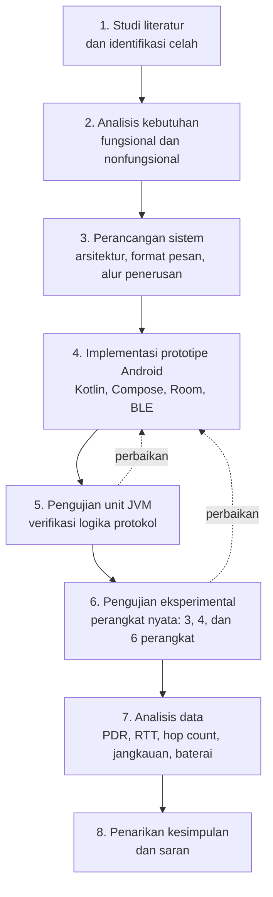
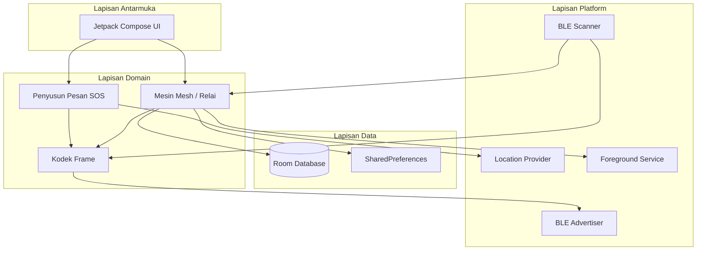
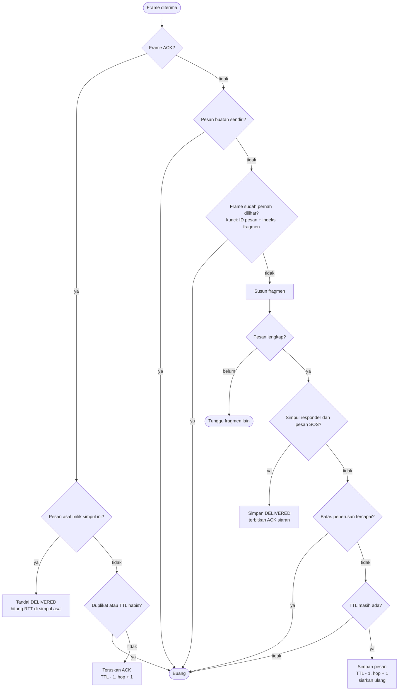
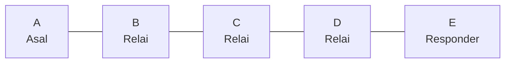
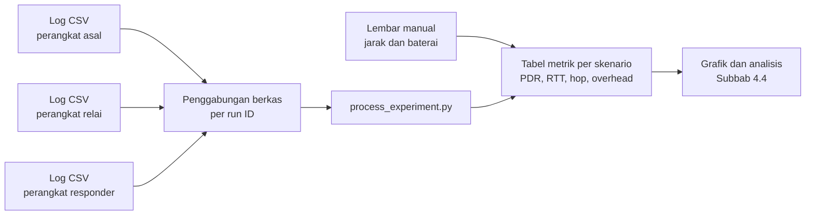

# ResQMesh: Rancang Bangun Komunikasi SOS Darurat Offline Berbasis Store and Forward Multi Hop BLE untuk Situasi Bencana

**Tech Quest Paper — Pekan Ilmiah Mahasiswa (PIM) Telkom University Surabaya 2026**

*(Tech Quest, Business Quest, Industrial Quest)*

---

## Lembar Pengesahan

| | |
|---|---|
| **Judul Karya Tulis** | ResQMesh: Rancang Bangun Komunikasi SOS Darurat Offline Berbasis Store and Forward Multi Hop BLE untuk Situasi Bencana |
| **Instansi** | Universitas Telkom Surabaya |
| **Sub Tema** | Tech Quest Paper |
| **Nama Lengkap** | Fathir Muhammad Arsy |
| **NIM** | 108072500036 |
| **Jurusan** | Informatika |
| **Universitas** | Universitas Telkom Surabaya |
| **Alamat email** | fathirmuhammadarsy1@gmail.com |
| **Alamat rumah dan No. Hp** | Jl. Jemurwonosari Gang Masjid 31d / 0895410889261 |

| | |
|---|---|
| **Dosen pendamping** | Dimas Chaerul Ekty Saputra |
| **Nama Lengkap dan Gelar** | Dimas Chaerul Ekty Saputra, S.Kom., M.Sc., Ph.D |
| **NIDN** | 6961776677130132 |
| **Alamat rumah dan No. Hp** | Surabaya / 081225763073 |

Surabaya, 7 Oktober 2026

| Dosen Pendamping, | Ketua Tim, |
|---|---|
| *(tanda tangan)* | *(tanda tangan)* |
| (Dimas Chaerul Ekty Saputra, S.Kom., M.Sc., Ph.D) | (Fathir Muhammad Arsy) |

---

## Lembar Pernyataan Orisinalitas

| | |
|---|---|
| **Judul Karya Tulis** | ResQMesh: Rancang Bangun Komunikasi SOS Darurat Offline Berbasis Store and Forward Multi Hop BLE untuk Situasi Bencana |
| **Nama Ketua** | Fathir Muhammad Arsy |
| **Nama Anggota** | 1. Andi Athallah Radja Maliq Muhammad 2. Bethari Nevyta Amaries 3. Amirah Essary Yunsarah Sujuthi |

Kami yang bertanda tangan di bawah ini menyatakan bahwa karya tulis dengan judul di atas benar merupakan karya orisinal yang dibuat oleh penulis dan belum pernah dipublikasikan dan/atau dilombakan diluar kegiatan PIM yang diselenggarakan oleh Badan Eksekutif Mahasiswa Telkom University Surabaya. Demikian pernyataan ini kami buat dengan sebenarnya, dan apabila terbukti terdapat pelanggaran di dalamnya, maka kami siap untuk didiskualifikasi dari kompetisi ini sebagai bentuk pertanggungjawaban kami.

Surabaya, 7 September 2026
Menyetujui,

| Dosen Pendamping, | Ketua Tim, |
|---|---|
| *(tanda tangan)* | *(tanda tangan)* |
| (Dimas Chaerul Ekty Saputra, S.Kom., M.Sc., Ph.D) | (Fathir Muhammad Arsy) |

---

## Kata Pengantar

Puji syukur kami panjatkan ke hadirat Tuhan Yang Maha Esa atas rahmat dan karunia-Nya sehingga karya tulis ilmiah berjudul "ResQMesh: Rancang Bangun Komunikasi SOS Darurat Offline Berbasis *Store and Forward Multi Hop* BLE untuk Situasi Bencana" dapat diselesaikan dengan baik.

Karya tulis ini disusun dalam rangka mengikuti kegiatan Pekan Ilmiah Mahasiswa. Penelitian ini membahas perancangan ResQMesh, yaitu prototipe sistem komunikasi SOS darurat berbasis Android yang memanfaatkan teknologi *Bluetooth Low Energy* (BLE) dengan mekanisme *store and forward multi hop* untuk mendukung pengiriman informasi ketika jaringan internet dan seluler mengalami gangguan akibat bencana.

Dalam penyusunan karya tulis ini, kami memperoleh arahan, dukungan, dan bantuan dari berbagai pihak. Oleh karena itu, kami mengucapkan terima kasih kepada:

1. Bapak Dimas Chaerul Ekty Saputra, S.Kom., M.Sc., Ph.D. selaku pembimbing yang telah memberikan arahan dan masukan selama penelitian.
2. Tim Daun Hijau sebagai tim penulis yang telah bekerja sama dalam proses perancangan dan penyelesaian karya tulis ini.
3. Teman-teman serta keluarga yang telah memberikan dukungan dan bantuan selama proses penyusunan karya tulis ini.

Kami menyadari bahwa karya tulis ini masih memiliki keterbatasan. Oleh karena itu, kritik dan saran yang membangun sangat kami harapkan untuk pengembangan penelitian selanjutnya. Semoga karya tulis ini dapat memberikan manfaat serta berkontribusi dalam pengembangan teknologi komunikasi darurat yang lebih adaptif terhadap kondisi bencana.

Surabaya, 07 Oktober 2026
Tim Daun Hijau

---

## Daftar Isi

- Halaman Sampul
- Lembar Pengesahan
- Lembar Pernyataan Orisinalitas
- Kata Pengantar
- Daftar Isi
- Abstrak
- *Abstract*
- Bab I Pendahuluan
  - 1.1 Latar Belakang
  - 1.2 Rumusan Masalah
  - 1.3 Tujuan Penulisan
  - 1.4 Manfaat Penelitian
- Bab II Tinjauan Pustaka
  - 2.1 Komunikasi Darurat Pascabencana
  - 2.2 Jaringan Ad Hoc Multi-Hop: MANET dan DTN
  - 2.3 Strategi Penerusan Pesan dan Pengendalian Banjir Pesan
  - 2.4 Bluetooth Low Energy sebagai Media Penerusan
  - 2.5 Keamanan, Ketahanan, dan Sinkronisasi Waktu
  - 2.6 Penelitian Terdahulu yang Relevan
  - 2.7 Celah Penelitian dan Posisi Kebaruan
- Bab III Metode Penelitian
  - 3.1 Pendekatan dan Jenis Penelitian
  - 3.2 Tahapan Penelitian
  - 3.3 Analisis Kebutuhan
  - 3.4 Arsitektur Sistem
  - 3.5 Perancangan Format Pesan
  - 3.6 Identitas dan Penyimpanan Lokal
  - 3.7 Mekanisme Penerusan Pesan
  - 3.8 Rancangan Pengujian Eksperimental
  - 3.9 Metrik dan Teknik Analisis Data
  - 3.10 Batasan Penelitian
- Bab IV Hasil dan Pembahasan
  - 4.1 Hasil Implementasi Prototipe
  - 4.2 Hasil Pengujian Unit dan Simulasi
  - 4.3 Hasil Pengujian Eksperimental pada Perangkat Nyata
  - 4.4 Pembahasan
- Daftar Pustaka

---

## Abstrak

Pada fase awal bencana, kemampuan korban meminta pertolongan sangat bergantung pada ketersediaan jaringan komunikasi, padahal infrastruktur seluler justru rentan rusak saat bencana terjadi. Akibatnya, korban sulit dijangkau dan penolong tidak mengetahui kondisi maupun lokasi mereka. Ponsel pintar yang dimiliki warga berpotensi menjadi perangkat penerus pesan yang tidak bergantung pada internet maupun jaringan seluler. Namun, penerusan pesan antarperangkat secara *multi hop* memerlukan pengendalian agar pesan tidak beredar berulang, tidak bertahan tanpa batas waktu, dan tidak menguras baterai. Penelitian ini bertujuan untuk merancang dan mengimplementasikan ResQMesh, prototipe komunikasi SOS berbasis *opportunistic mesh network* pada ponsel pintar Android yang memakai *Bluetooth Low Energy* (BLE). Metode yang digunakan adalah pengembangan prototipe disertai dengan pengujian eksperimental. Setiap pesan SOS yang dikirim berisi identitas pengirim, koordinat GPS, akurasi lokasi, stempel waktu, dan status darurat, kemudian diteruskan melalui mekanisme *store and forward, time to live* (TTL), penghitung *hop,* deteksi pesan duplikat, serta pengakuan penerimaan (ACK). Pengujian ini dilakukan pada tiga skenario dengan 3, 4, dan 6 perangkat, dengan menilai *message delivery rate, latency, hop count,* jangkauan, dan konsumsi baterai. Penelitian ini diharapkan menunjukkan pengaruh jumlah perangkat relay terhadap keberhasilan, kecepatan, dan efisiensi energi pengiriman pesan SOS, sekaligus menghasilkan prototipe aplikasi Android yang mendukung komunikasi darurat ketika infrastruktur jaringan terganggu.

**Kata Kunci:** komunikasi darurat, jaringan oportunistik, *mesh network*, *bluetooth low energy*, ponsel pintar.

---

## *Abstract*

*During the early phase of a disaster, the ability of victims to request assistance highly depends on the availability of communication networks, while cellular infrastructure is vulnerable to damage when disasters occur. As a result, victims become difficult to reach, and rescuers have limited information regarding their conditions and locations. Mobile devices owned by the community have the potential to serve as message relay devices without relying on internet or cellular networks. However, multi-hop message forwarding between devices requires control mechanisms to prevent repeated message transmission, unlimited message propagation, and excessive battery consumption. This research aims to design and implement ResQMesh, a prototype of an SOS communication system based on an opportunistic mesh network on Android mobile devices using Bluetooth Low Energy (BLE). The method used in this research is prototype development followed by experimental testing. Each transmitted SOS message contains sender identity, GPS coordinates, location accuracy, timestamp, and emergency status, which are forwarded through a store-and-forward mechanism equipped with Time to Live (TTL), hop count, duplicate message detection, and acknowledgment (ACK). The testing is conducted using three scenarios involving 3, 4, and 6 devices by evaluating message delivery rate, latency, hop count, communication range, and battery consumption. This research is expected to demonstrate the effect of the number of relay devices on the success, speed, and energy efficiency of SOS message delivery, while producing an Android prototype that supports emergency communication when network infrastructure is disrupted.*

***Keywords:*** *emergency communication, opportunistic network, mesh network, Bluetooth Low Energy, mobile devices.*

---

## BAB I — PENDAHULUAN

### 1.1 Latar Belakang

Komunikasi merupakan salah satu aspek penting dalam mendukung keselamatan manusia, khususnya pada kondisi darurat dan bencana. Dalam kondisi ideal, keberadaan jaringan seluler dan internet memungkinkan masyarakat menyampaikan informasi mengenai kondisi, lokasi, serta kebutuhan pertolongan secara cepat kepada keluarga maupun pihak berwenang. Ketersediaan komunikasi juga membantu tim penyelamat memperoleh informasi awal mengenai kondisi dan keberadaan korban sehingga respons penanganan dapat dilakukan secara lebih terarah. Selain itu, perangkat ponsel pintar yang telah banyak digunakan masyarakat memiliki potensi untuk dimanfaatkan sebagai media pendukung komunikasi darurat karena perangkat tersebut umumnya tetap berada bersama pengguna ketika bencana terjadi (Tai & Yu, 2022). Oleh karena itu, keberlangsungan komunikasi menjadi faktor penting dalam mendukung proses penyelamatan korban.

Kondisi ideal tersebut tidak selalu dapat dipertahankan ketika bencana terjadi. Bencana alam seperti gempa bumi, banjir, dan tanah longsor sering kali merusak infrastruktur telekomunikasi tepat ketika kebutuhan komunikasi menjadi tinggi. Infrastruktur seluler yang terpasang dapat rusak sebagian atau seluruhnya setelah bencana (Reina et al., 2015a). Akibatnya, korban tidak dapat meminta pertolongan, keluarga ataupun tim penyelamat tidak dapat mengetahui kondisi maupun lokasi mereka. Dalam periode 72 jam pertama pascabencana dikenal sebagai *golden relief time,* karena peluang dalam menemukan korban selamat akan menurun secara drastis setelahnya (Reina et al., 2015a). Oleh sebab itu, komunikasi pada fase awal bencana menjadi sangat penting.

Kebutuhan akan komunikasi yang memadai dalam kondisi bencana menjadi semakin penting di Indonesia, mengingat tingginya frekuensi kejadian bencana di berbagai wilayah. Berdasarkan data Badan Nasional Penanggulangan Bencana (BNPB), selama periode Januari hingga Desember 2025 tercatat sebanyak 3.223 kejadian bencana di Indonesia (*Buletin-Info-Bencana-Desember-2025 (1)*, n.d.). Tingginya frekuensi tersebut tidak hanya berdampak terhadap masyarakat dan lingkungan, tetapi juga berpotensi mengganggu infrastruktur telekomunikasi yang berperan penting dalam penanggulangan bencana. Gangguan tersebut menghambat pertukaran informasi yang dibutuhkan dalam situasi darurat (Wang et al., 2023). Oleh karena itu, diperlukan alternatif komunikasi yang tetap memungkinkan pertukaran informasi ketika infrastruktur telekomunikasi utama terganggu atau tidak dapat digunakan.

Salah satu pendekatan yang banyak diusulkan adalah komunikasi *ad hoc multi hop* antarponsel pintar. Hampir semua ponsel pintar sudah dilengkapi dengan *Wi-Fi* dan *Bluetooth,* sehingga perangkat milik warga dapat menjadi simpul jaringan tanpa infrastruktur tambahan (Reina et al., 2015a). Pesan dari ponsel yang tidak memiliki sinyal diteruskan oleh ponsel lain di sekitarnya, *hop* demi *hop,* sampai mencapai perangkat penerima atau *gateway.*

Literatur membedakan dua paradigma utama. Pada *Mobile Ad Hoc Network* (MANET), jalur sumber dan tujuan harus tersedia dan dipelihara, sehingga dibutuhkan kepadatan simpul yang tinggi. Kemudian pada *Delay Tolerant Network* (DTN) atau jaringan oportunistik, pesan disimpan dan akan dibawa oleh simpul sampai bertemu dengan simpul lain yang akan diteruskan (*store – carry – forward*), sehingga akan cocok untuk jaringan yang jarang atau sangat dinamis (Reina et al., 2015a). Konsep DTN sendiri berakar pada arsitektur penerusan pesan asinkron dengan asumsi konektivitas ujung ke ujung yang terbatas (Fall, 2003). Kemudian muncul berbagai strategi penerusan yaitu *epidemic* yang saling bertukar pesan pada setiap pertemuan, PRoPHET yang memakai probabilitas pertemuan, dan *spray and wait* yang membatasi jumlah salinan pesan (Lindgren et al., n.d.; Spyropoulos et al., 2005). Salah satu studi yang dirangkum dalam sebuah survei menyimpulkan bahwa tidak ada protokol yang terbaik secara mutlak, karena pilihannya bergantung pada skenario dan metrik yang dioptimalkan (Reina et al., 2015a).

Sejumlah penelitian telah menguji pendekatan tersebut pada ponsel pintar. Uji lapangan dalam skala besar dilakukan dengan 125 peserta dalam skenario bencana terskrip, menggunakan DTN berbasis *Wi-fi ad hoc,* hasil menunjukkan bahwa konektivitas antarponsel cukup untuk layanan darurat berbasis teks, dengan rata–rata jarak koneksi sekitar 44 meter dan durasi kontak median sekitar 97 detik (Álvarez et al., 2018). Pada hasil uji yang sama, sebuah pesan *multicast* rata–rata hanya sampai ke 21,77% simpul dalam masa hidup pesan 60 menit (Álvarez et al., 2018). Pada penelitian lain, aplikasi pesan antarperangkat memakai *Bluetooth Low Energy* (BLE) sebagai teknologi koneksi utama karena lebih hemat energi dibandingkan dengan *Wi-fi,* dengan format pesan yang dapat memuat lokasi (Höchst et al., n.d.). Sistem SOS ringan juga telah dirancang untuk komunikasi *ad hoc* antara korban dan petugas pertolongan pertama (Al-Akkad et al., 2014). Selain itu, prototipe Android yang membentuk jaringan *ad hoc* dengan *Wi-fi Direct* atau *Bluetooth* telah dikembangkan untuk penyintas bencana.

Meskipun demikian, terdapat beberapa tantangan yang masih relevan dengan penelitian ini. Pertama, sebagian besar studi masih berbasis simulasi. Berdasarkan hasil survei yang telah dilakukan dapat disimpulkan bahwa lebih banyak dibutuhkan eksperimen nyata, karena sebagian besar penelitian yang dilakukan pada jaringan *ad hoc* untuk bencana hanya berhenti pada tahap simulasi (Reina et al., 2015b). Kedua, konsumsi energi juga perlu diperhatikan secara bersamaan dengan kepadatan perangkat dan jumlah *hop,* hal tersebut dikarenakan penggunaan *Bluetooth* pada ponsel sering diketahui meningkatkan konsumsi daya, padahal daya tahan baterai sangat berperan penting pada saat bencana terjadi (Reina et al., 2015b). Ketiga, pesan SOS memerlukan struktur dan mekanisme pengendali khusus. Pesan tersebut memuat identitas, koordinat GPS, akurasi lokasi, stempel waktu, dan status darurat, serta memerlukan TTL, penghitung *hop,* deteksi pesan duplikat, dan pengakuan penerimaan (ACK). Selain itu, perangkat tanpa sumber sinkronisasi waktu memiliki jam yang tidak seragam, hal tersebut menyebabkan stempel waktu antarperangkat berbeda juga diperlukan di sini (Álvarez et al., 2018). Keempat, BLE sendiri memiliki keterbatasan teknis, yaitu batasan muatan yang umum sebesar 20 byte yang menuntut pemecahan data, sehingga pesan darurat perlu dirancang dengan ringkas (Höchst et al., n.d.).

Namun, di sisi lain pesan SOS memiliki prioritas yang berbeda dari pesan biasa. Simulasi ini menunjukkan bahwa penerusan yang memperhitungkan prioritas pesan darurat dapat meningkatkan rasio pengiriman pesan prioritas dibandingkan dengan protokol DTN umum (*2016 8th International Conference on Communication Systems and Networks*, 2016).

Sepanjang penelusuran literatur yang dilakukan penulis, penelitian yang secara bersamaan dalam mengevaluasi komunikasi antarperangkat berbasis BLE, penerusan *multi-hop* dengan mekanisme TTL, deteksi duplikat, dan ACK, serta pesan SOS yang berlokasi pada prototipe ponsel pintar nyata, masih sangat terbatas. Celah inilah yang ingin diisi oleh penelitian ini. Penelitian ini dilakukan untuk merancang dan menguji prototipe ResQMesh, yaitu sistem komunikasi SOS darurat berbasis *opportunistic mesh network* antarperangkat yang tetap berfungsi tanpa internet maupun jaringan seluler, lalu mengukur efektivitasnya pada berbagai jumlah perangkat dan jarak.

### 1.2 Rumusan Masalah

1. Bagaimana merancang dan mengimplementasikan prototipe sistem komunikasi SOS darurat berbasis *device to device opportunistic mesh network* pada ponsel pintar Android yang bekerja tanpa internet dan jaringan seluler?
2. Bagaimana mekanisme penerusan pesan (*store and forward,* TTL, penghitung *hop,* deteksi pesan duplikat, dan ACK) dirancang agar pesan SOS dapat diteruskan secara *multi hop*?
3. Bagaimana pengaruh jumlah perangkat relay terhadap jangkauan komunikasi dan konsumsi baterai?

### 1.3 Tujuan Penulisan

1. Merancang dan mengimplementasikan prototipe sistem komunikasi SOS darurat berbasis *device to device opportunistic mesh network* pada perangkat Android yang dapat beroperasi tanpa internet dan jaringan seluler.
2. Merancang dan menerapkan mekanisme penerusan pesan SOS secara *store and forward multi hop* yang mencakup TTL, hop count, deteksi pesan duplikat, dan ACK agar pesan dapat diteruskan antarperangkat secara efektif.
3. Menguji dan menganalisis pengaruh jumlah perangkat relay terhadap jangkauan komunikasi dan konsumsi baterai dalam pengiriman pesan SOS pada prototipe ResQMesh.

### 1.4 Manfaat Penelitian

#### 1. Manfaat Teoritis

Penelitian ini diharapkan dapat memperkaya kajian mengenai komunikasi darurat berbasis *opportunistic mesh network* melalui implementasi dan pengujian pada perangkat ponsel pintar nyata. Hasil penelitian memberikan gambaran mengenai pengaruh jumlah perangkat *relay* terhadap jangkauan komunikasi dan konsumsi baterai dalam penerusan pesan SOS secara *store and forward multi hop* berbasis *Bluetooth Low Energy* (BLE). Penelitian ini juga dapat menambah pemahaman mengenai penerapan mekanisme komunikasi darurat yang tidak bergantung pada internet maupun jaringan seluler.

#### 2. Manfaat Praktis

**a. Bagi Pengembang Sistem**

Hasil penelitian dapat menjadi acuan dalam merancang dan mengembangkan sistem komunikasi darurat berbasis BLE, khususnya dalam menentukan mekanisme penerusan pesan, jumlah perangkat relay, serta mempertimbangkan jangkauan komunikasi dan konsumsi baterai.

**b. Bagi Pihak Kebencanaan**

Hasil penelitian dapat memberikan gambaran mengenai potensi komunikasi antarperangkat sebagai alternatif penyampaian pesan SOS ketika jaringan internet dan seluler mengalami gangguan, sehingga dapat menjadi bahan pertimbangan dalam pengembangan teknologi komunikasi darurat.

**c. Bagi Peneliti Selanjutnya**

Prototipe ResQMesh dan hasil pengujiannya dapat menjadi dasar untuk penelitian dan pengembangan lebih lanjut, terutama dalam meningkatkan jangkauan, efisiensi energi, keandalan penerusan pesan, serta kemampuan komunikasi pada kondisi jaringan yang tidak stabil.

---

## BAB II — TINJAUAN PUSTAKA

Bab ini menguraikan landasan teori yang menopang rancangan ResQMesh, yaitu komunikasi darurat pascabencana, jaringan *ad hoc multi-hop* (MANET dan DTN), strategi penerusan pesan beserta pengendali banjir pesan, peran *Bluetooth Low Energy* (BLE) sebagai media transmisi, serta aspek keamanan dan sinkronisasi waktu. Bab ini ditutup dengan tinjauan penelitian terdahulu yang relevan dan penegasan posisi kebaruan (*novelty*) penelitian.

### 2.1 Komunikasi Darurat Pascabencana

Komunikasi darurat pascabencana adalah pertukaran informasi mengenai kondisi, lokasi, dan kebutuhan pertolongan ketika sarana komunikasi normal tidak dapat diandalkan. Wang et al. (2023) dalam tinjauannya menegaskan bahwa gangguan pada infrastruktur telekomunikasi menghambat pertukaran informasi yang dibutuhkan dalam penanggulangan bencana. Reina et al. (2015a) menyebutkan bahwa infrastruktur seluler dapat rusak sebagian atau seluruhnya setelah bencana, sedangkan Álvarez et al. (2018) menambahkan bahwa infrastruktur pascabencana tidak hanya rusak, tetapi juga dapat mengalami kelebihan beban (*overloaded*). Kedua kondisi tersebut bermuara pada hal yang sama: korban kehilangan jalur untuk meminta pertolongan pada fase awal ketika peluang penyelamatan paling besar.

Sifat pesan SOS ikut menentukan rancangan sistem. Sciullo et al. (2020) merancang aplikasi komunikasi darurat yang hanya menyampaikan data darurat yang minimal namun vital. Dengan demikian, pesan SOS idealnya pendek, memuat identitas dan posisi pengirim, serta memiliki status yang menunjukkan tingkat kedaruratan. Pesan yang ringkas lebih mudah diteruskan melalui kontak antarperangkat yang singkat dan media dengan muatan terbatas seperti BLE.

### 2.2 Jaringan Ad Hoc Multi-Hop: MANET dan DTN

Pada jaringan *ad hoc multi-hop*, ponsel yang berada di luar jangkauan penerima meminta ponsel lain di sekitarnya untuk meneruskan pesan, *hop* demi *hop* (Reina et al., 2015a). Literatur membedakan dua paradigma utama, yang diringkas pada Tabel 2.1.

**Tabel 2.1 Perbandingan paradigma MANET dan DTN/jaringan oportunistik**

| Aspek | MANET | DTN / Jaringan Oportunistik |
|---|---|---|
| Jalur sumber–tujuan | Harus tersedia dan dipelihara selama pengiriman | Tidak diasumsikan tersedia |
| Kebutuhan kepadatan simpul | Tinggi | Dapat rendah atau sangat dinamis |
| Penanganan keterputusan | Pengiriman gagal bila jalur putus | Pesan disimpan dan dibawa sampai bertemu simpul berikutnya (*store–carry–forward*) |
| Kesesuaian | Area padat dan stabil | Jaringan jarang atau sangat dinamis |

*Sumber: dirangkum dari Reina et al. (2015a) dan Fall (2003).*

Konsep DTN berakar pada arsitektur penerusan pesan asinkron dengan asumsi konektivitas ujung ke ujung yang terbatas (Fall, 2003). Dalam konteks bencana, asumsi ini realistis: Álvarez et al. (2018) melaporkan bahwa pada uji lapangan dengan 125 peserta, peserta cenderung bergerak dalam kelompok kecil sehingga jaringan terbentuk dari kontak-kontak yang terputus-putus, bukan dari lapisan jaringan yang selalu terhubung.

Dalam penelitian ini, istilah *opportunistic mesh network* dipakai untuk jaringan yang jalur penerusannya terbentuk secara oportunistik pada setiap pertemuan antarsimpul tanpa tabel rute terpusat, dengan pesan disimpan sementara pada tiap simpul. Pendekatan ini menempatkan ResQMesh pada paradigma DTN, bukan MANET.

### 2.3 Strategi Penerusan Pesan dan Pengendalian Banjir Pesan

Karena jalur ujung ke ujung tidak dijamin, DTN mengandalkan replikasi pesan. Tiga keluarga strategi yang banyak dirujuk adalah sebagai berikut.

1. ***Epidemic routing*** menyalin pesan ke setiap simpul yang ditemui (Vahdat & Becker, 2000). Peluang sampainya pesan tinggi, tetapi biaya bandwidth, penyimpanan, dan baterai juga tinggi.
2. **PRoPHET** memakai probabilitas pertemuan yang dihitung dari riwayat kontak untuk memilih simpul penerus (Lindgren et al., n.d.).
3. ***Spray and Wait*** membatasi jumlah salinan pesan yang beredar (Spyropoulos et al., 2005).

Reina et al. (2015a) menyimpulkan bahwa tidak ada protokol yang terbaik secara mutlak karena pilihannya bergantung pada skenario dan metrik yang dioptimalkan. Bagi pesan SOS, penulis berpendapat bahwa pendekatan berbasis prediksi pertemuan dengan tujuan tertentu kurang langsung berlaku, sebab penerima pesan SOS bukan satu simpul tetap melainkan penolong mana pun yang berada dalam jangkauan jaringan. Yang lebih relevan adalah pembatasan replikasi dan pengendalian banjir pesan.

Pengendalian tersebut umumnya disusun dari beberapa mekanisme dasar yang diringkas pada Tabel 2.2. Mekanisme-mekanisme ini yang menjadi dasar perancangan penerusan pesan ResQMesh (dijabarkan pada Bab III).

**Tabel 2.2 Mekanisme dasar pengendali penerusan pesan multi-hop**

| Mekanisme | Fungsi | Rujukan / catatan |
|---|---|---|
| *Time to Live* (TTL) atau batas *hop* | Membatasi jangkauan penyebaran dan mencegah pesan beredar tanpa akhir | Prinsip umum jaringan multi-hop |
| Umur pesan berbasis waktu | Membuang pesan yang sudah terlalu lama; contoh pada uji lapangan: umur *bundle* 60 menit | Álvarez et al. (2018) |
| Penghitung *hop* | Mencatat jarak topologi yang telah ditempuh pesan | Prinsip umum jaringan multi-hop |
| Deteksi pesan duplikat (ID pesan unik) | Menghentikan penerusan berulang atas pesan yang sama | Prinsip umum jaringan multi-hop |
| Pengakuan penerimaan (ACK) | Menandai bahwa pesan telah diterima penolong sehingga pengulangan dapat dihentikan | Prinsip umum jaringan multi-hop |
| Penekanan berbasis penghitung (*Trickle*) | Menunda atau membatalkan pengiriman ulang bila tetangga sudah cukup banyak menyiarkan pesan yang sama | Levis et al. (2011) |
| Mitigasi *flooding* dan identitas ganda | Menahan penyalahgunaan jaringan oleh simpul berbahaya | Stute et al. (2020) |

Selain pengendali dasar, pesan darurat memiliki prioritas yang berbeda dari pesan biasa. Bhattacharjee et al. (2016) mengusulkan pengiriman pesan darurat secara *best-effort* dengan penyaringan berbasis konten dan PRoPHET yang ditingkatkan dengan prioritas pada DTN pascabencana, sehingga pesan darurat diperlakukan lebih dahulu dibandingkan pesan lain.

### 2.4 *Bluetooth Low Energy* sebagai Media Penerusan

BLE adalah varian Bluetooth berdaya rendah yang tersedia pada hampir semua ponsel pintar modern. Álvarez et al. (2019) mencatat bahwa standar Bluetooth Mesh yang dibangun di atas BLE kompatibel mundur dengan Bluetooth 4.0, sehingga sebagian besar perangkat bergerak masa kini dapat bergabung ke jaringan semacam itu. Pada ResQMesh, BLE tidak dipakai melalui sambungan tertaut (*connection-oriented*), melainkan lewat siaran iklan (*advertising*) yang dapat diterima banyak perangkat di sekitar sekaligus, sehingga tidak diperlukan proses pasangan (*pairing*) antarperangkat.

Keterbatasan utama jalur ini adalah muatan per frame yang sangat kecil, sehingga pesan SOS harus dirancang ringkas dan, bila perlu, dipecah menjadi beberapa frame. ⚠️ **[SITASI DIPERLUKAN: batas muatan frame *advertising* BLE, rujuk Bluetooth Core Specification atau dokumentasi Android BLE (developer.android.com)]**.

Selain muatan, energi adalah pertimbangan praktis. Reina et al. (2015b) mencatat bahwa penggunaan Bluetooth pada ponsel meningkatkan konsumsi daya, padahal daya tahan baterai sangat penting saat bencana. Bukti praktis serupa terlihat pada uji lapangan Álvarez et al. (2018), ketika setiap peserta dibekali baterai tambahan untuk mengimbangi peningkatan konsumsi energi selama pengujian. Karena itu, konsumsi baterai diukur sebagai salah satu metrik utama penelitian ini.

**Tabel 2.3 Teknologi radio pada penelitian komunikasi darurat antarponsel**

| Teknologi | Karakteristik yang dilaporkan | Rujukan |
|---|---|---|
| Wi-Fi *ad hoc* (IBR-DTN) | Rata-rata jarak koneksi sekitar 44 m; durasi kontak median sekitar 97 detik; pada pengujian tim peneliti, mode *ad hoc* dijalankan pada tipe perangkat tertentu yang telah mereka kuasai | Álvarez et al. (2018) |
| Bluetooth Mesh (berbasis BLE) | Dapat menghubungkan ratusan perangkat; kompatibel mundur dengan Bluetooth 4.0; bergantung pada perangkat IoT yang masih beroperasi | Álvarez et al. (2019) |
| LoRa (dengan ponsel via BLE) | Jangkauan jauh antarperangkat; memerlukan *transceiver* LoRa tambahan | Sciullo et al. (2020); Höchst et al. (n.d.) |
| BLE *advertising* | Berdaya rendah; muatan per frame sangat kecil; tanpa perangkat tambahan | Pendekatan ResQMesh |

### 2.5 Keamanan, Ketahanan, dan Sinkronisasi Waktu

Jaringan penerus pesan yang terbuka rentan disalahgunakan. Stute et al. (2020) menunjukkan bahwa DTN antarponsel rentan terhadap manipulasi rute, pembuangan pesan, manipulasi isi pesan, *blackholing*, dan peniruan identitas, serta terhadap *flooding* dan serangan Sybil (satu pihak memakai banyak identitas). Kerangka RESCUE menjawabnya dengan protokol DTN minimalis yang aman secara desain dan infrastruktur sertifikat bergerak yang terdistribusi untuk menghambat identitas ganda. Keamanan yang kuat berarti tambahan beban komputasi dan kompleksitas pertukaran kunci. Karena itu, pada tahap prototipe, ResQMesh memprioritaskan ketersediaan dan kecepatan pesan, dan keterbatasan keamanannya dinyatakan secara eksplisit sebagai batasan penelitian.

Aspek lain adalah sinkronisasi waktu. Álvarez et al. (2018) menemukan bahwa perangkat tanpa akses internet maupun sumber sinkronisasi waktu lain memiliki jam yang tidak seragam, sehingga mereka harus menyelaraskan cap waktu secara manual berdasarkan perangkat acuan. Implikasinya bagi penelitian ini, pengukuran *latency* sebaiknya tidak mengandalkan selisih jam dua perangkat yang berbeda.

### 2.6 Penelitian Terdahulu yang Relevan

Bagian ini membahas penelitian terdahulu yang paling relevan dengan ResQMesh. Ringkasan perbandingannya disajikan pada Tabel 2.4.

**Álvarez et al. (2018).** Penelitian ini melakukan uji lapangan skala besar terhadap layanan darurat berbasis ponsel yang bergantung penuh pada komunikasi *ad hoc*. Uji dilakukan pada September 2017 dengan 125 peserta dalam skenario bencana terskrip selama satu hari. Aplikasi Android memuat layanan seperti pesan SOS, dan antarperangkat berkomunikasi lewat IBR-DTN melalui Wi-Fi mode *ad hoc* dengan prinsip *store–carry–forward*. Rata-rata jarak koneksi tercatat sekitar 44 m, durasi kontak median sekitar 97 detik, dan sebuah pesan *multicast* rata-rata hanya menjangkau 27 simpul atau 21,77% jaringan dalam umur pesan 60 menit, sedangkan pesan terbaik menjangkau 69,35%. Hujan dan bangunan juga menurunkan jangkauan efektif. Penelitian ini membuktikan kelayakan jaringan ponsel untuk layanan darurat berbasis teks, tetapi memakai Wi-Fi, bukan BLE, dan hanya mencakup satu skenario terskrip.

**Al-Akkad et al. (2014).** Penelitian ini merancang dan mengevaluasi sistem S.O.S. *ad hoc* ringan untuk ponsel pintar yang memungkinkan komunikasi antara korban dan petugas pertolongan pertama. Gagasan dasarnya, yaitu pesan SOS ringkas tanpa infrastruktur, diambil oleh ResQMesh, dengan kontribusi yang difokuskan pada pengendalian penerusan *multi-hop* dan pengukuran kinerja kuantitatif.

**Sciullo et al. (2020).** LOCATE adalah sistem komunikasi darurat yang menghubungkan aplikasi ponsel dengan *transceiver* LoRa lewat BLE, sehingga permintaan darurat disiarkan ulang oleh perangkat lain hingga mencapai petugas penyelamat yang dapat menanganinya. Protokol diseminasi *multi-hop*-nya dibandingkan dengan skema *flooding* yang ada melalui simulasi OMNeT++, sedangkan kemampuan LoRa menyampaikan pesan darurat jarak jauh dan lokalisasi tanpa GPS berbasis trilaterasi dinilai lewat eksperimen. Jangkauan LoRa jauh lebih panjang, tetapi sistem ini memerlukan perangkat keras tambahan, sedangkan ResQMesh berupaya bekerja hanya dengan ponsel. Höchst et al. (n.d.) juga mengkaji komunikasi antarponsel berbasis LoRa untuk skenario krisis. Penelitian terbaru oleh Khamaisi dkk. (2025) memadukan MANET berbasis LoRa dengan aplikasi ponsel untuk komunikasi sipil di luar jaringan (*off-grid*); uji lapangan perkotaannya melaporkan *packet delivery ratio* 92% dan skor *System Usability Scale* 74/100. Keduanya menunjukkan kecenderungan riset ke arah LoRa, yang mengharuskan perangkat tambahan.

**Álvarez et al. (2019).** Bluemergency mengusulkan jaringan darurat berbasis Bluetooth Mesh yang memanfaatkan perangkat IoT di kota digital yang masih beroperasi untuk menengahi komunikasi antarperangkat pascabencana, dengan model *vendor* Bluetooth Mesh untuk pertukaran data antarperangkat bergerak. Para penulis menyatakan bahwa jaringan pascabencana yang murni berbasis ponsel masih sulit diwujudkan secara praktis. Keterbatasannya adalah ketergantungan pada keberadaan dan keberfungsian perangkat IoT atau simpul mesh, yang tidak selalu ada di lokasi bencana.

**Stute et al. (2020).** RESCUE adalah kerangka komunikasi antarperangkat yang tangguh dan aman untuk keadaan darurat. Protokol DTN minimalisnya aman secara desain terhadap manipulasi rute, pembuangan pesan, manipulasi isi pesan, *blackholing*, dan peniruan identitas, dilengkapi mitigasi terhadap *flooding* dan serangan Sybil. Evaluasinya berupa simulasi skala besar pada skenario sintetis dan skenario bencana alam yang realistis, dengan laju pengiriman pesan yang sangat baik bahkan di bawah serangan. Fokusnya keamanan, dan buktinya berasal dari simulasi, bukan prototipe di ponsel nyata.

**Bhattacharjee et al. (2016).** Penelitian ini menyoroti perlunya perlakuan khusus untuk pesan darurat pada DTN pascabencana lewat penyaringan konten dan PRoPHET berprioritas, sebagai dasar pertimbangan bahwa SOS tidak diperlakukan setara dengan pesan biasa.

**Tabel 2.4 Ringkasan penelitian terdahulu yang relevan**

| Penelitian | Teknologi | Mekanisme penerusan | Jenis evaluasi | Catatan relevansi / keterbatasan |
|---|---|---|---|---|
| Álvarez et al. (2018) | Wi-Fi *ad hoc* (IBR-DTN) | *Store–carry–forward* DTN | Uji lapangan, 125 peserta | Bukan BLE; satu skenario terskrip |
| Sciullo et al. (2020) | LoRa; BLE ponsel–*transceiver* | Protokol diseminasi *multi-hop* (dibandingkan dengan *flooding*) | Simulasi OMNeT++ dan eksperimen LoRa | Memerlukan *transceiver* LoRa tambahan |
| Álvarez et al. (2019) | Bluetooth Mesh | Relai jaringan mesh | Konsep dan uji kelayakan | Bergantung pada perangkat IoT / simpul mesh |
| Stute et al. (2020) | DTN antarperangkat | DTN minimalis yang aman | Simulasi skala besar | Berfokus pada keamanan; tanpa prototipe ponsel nyata |
| Bhattacharjee et al. (2016) | DTN pascabencana | PRoPHET berprioritas dan penyaringan konten | Simulasi | Penekanan pada prioritas pesan darurat |
| Khamaisi dkk. (2025) | LoRa MANET + aplikasi ponsel | Jaringan mesh LoRa | Uji lapangan perkotaan dan uji kegunaan | Memerlukan perangkat LoRa |

### 2.7 Celah Penelitian dan Posisi Kebaruan

Dari tinjauan di atas, terlihat beberapa pola. Pertama, bukti yang paling kuat tentang jaringan ponsel untuk bencana berasal dari uji lapangan berbasis Wi-Fi *ad hoc* (Álvarez et al., 2018), sedangkan penelitian yang menekankan BLE cenderung berbentuk konsep atau uji kelayakan (Álvarez et al., 2019). Kedua, penelitian yang mengevaluasi protokol penerusan dan keamanan banyak bersandar pada simulasi (Bhattacharjee et al., 2016; Stute et al., 2020), sejalan dengan catatan Reina et al. (2015b) bahwa sebagian besar studi jaringan *ad hoc* bencana berhenti di simulasi. Ketiga, pendekatan jarak jauh umumnya memerlukan perangkat tambahan, misalnya LoRa (Sciullo et al., 2020). Keempat, konsumsi baterai jarang dipelajari bersamaan dengan jumlah perangkat relai dan jumlah *hop*.

**Tabel 2.5 Posisi ResQMesh dibandingkan penelitian terdahulu**

| Aspek | ResQMesh | LOCATE (Sciullo et al., 2020) | Bluemergency (Álvarez et al., 2019) | RESCUE (Stute et al., 2020) | Uji lapangan (Álvarez et al., 2018) |
|---|---|---|---|---|---|
| Media antarponsel | BLE *advertising* | LoRa (BLE hanya ke *transceiver*) | Bluetooth Mesh | DTN antarperangkat | Wi-Fi *ad hoc* |
| Perangkat tambahan | Tidak ada | *Transceiver* LoRa | Simpul / perangkat IoT mesh | Tidak ada | Tidak ada |
| Bukti evaluasi | Eksperimen perangkat nyata pada 3, 4, dan 6 perangkat (Bab IV) | Simulasi dan eksperimen LoRa | Konsep dan uji kelayakan | Simulasi skala besar | Uji lapangan 125 peserta |
| Fokus utama | SOS berlokasi, kontrol penerusan, jangkauan, baterai | Diseminasi jarak jauh | Integrasi IoT | Keamanan | Data mobilitas dan interaksi pengguna |
| Keamanan | Belum; diakui sebagai batasan | — | — | Ya, secara desain | — |

Berdasarkan celah tersebut, kebaruan ResQMesh berada pada kombinasi berikut, sepanjang penelusuran literatur yang dilakukan penulis.

1. **Hanya ponsel dan BLE.** Sistem bekerja pada ponsel Android tanpa *transceiver* LoRa, simpul IoT, maupun infrastruktur lain.
2. **Struktur SOS ringkas dengan kontrol penerusan terpadu.** Pesan SOS berisi identitas, koordinat, akurasi lokasi, stempel waktu, dan status darurat dalam format yang muat pada frame BLE, diteruskan melalui *store and forward* dengan TTL, penghitung *hop*, deteksi duplikat, dan ACK secara bersamaan.
3. **Eksperimen pada perangkat nyata.** Kinerja diukur langsung pada ponsel pada tiga skenario (3, 4, dan 6 perangkat), tidak hanya lewat simulasi.
4. **Hubungan jumlah relai dengan jangkauan dan baterai.** Penelitian ini secara eksplisit menganalisis pengaruh jumlah perangkat relai terhadap jangkauan komunikasi dan konsumsi baterai, sesuai rumusan masalah ketiga.

Penelitian ini tidak mengklaim keunggulan atas penelitian lain pada aspek yang bukan fokusnya, seperti jangkauan jarak jauh LoRa atau keamanan RESCUE; kedua aspek tersebut dicatat sebagai arah pengembangan lanjutan pada Bab V. Pembahasan metode untuk menjawab rumusan masalah akan diuraikan pada Bab III.

---

## BAB III — METODE PENELITIAN

Bab ini menjelaskan pendekatan dan tahapan penelitian, analisis kebutuhan, perancangan sistem ResQMesh, serta rancangan pengujian eksperimental yang dipakai untuk menjawab rumusan masalah. Uraian perancangan disusun berdasarkan kode sumber prototipe pada repositori penelitian, sehingga struktur data, parameter protokol, dan alur penerusan pesan yang dijabarkan di sini mencerminkan implementasi yang sebenarnya.

### 3.1 Pendekatan dan Jenis Penelitian

Penelitian ini menggunakan pendekatan **penelitian dan pengembangan (*research and development*) berbasis prototipe** yang dilanjutkan dengan **pengujian eksperimental kuantitatif**. Pendekatan pengembangan dipakai untuk menjawab rumusan masalah pertama dan kedua, yaitu merancang serta mengimplementasikan sistem komunikasi SOS beserta mekanisme penerusan pesannya. Pendekatan eksperimental dipakai untuk menjawab rumusan masalah ketiga, yaitu pengaruh jumlah perangkat relai terhadap jangkauan komunikasi dan konsumsi baterai.

Variabel penelitian pada tahap eksperimen disajikan pada Tabel 3.1.

**Tabel 3.1 Variabel penelitian**

| Jenis variabel | Variabel | Keterangan |
|---|---|---|
| Bebas | Jumlah perangkat dalam jaringan | 3, 4, dan 6 perangkat |
| Bebas | Jarak antarperangkat | Dinaikkan bertahap pada tiap skenario (ditentukan saat pengujian) |
| Terikat | *Message delivery rate* (*Packet Delivery Ratio*, PDR) | Persentase pesan SOS yang terkonfirmasi sampai |
| Terikat | *Latency* (*Round-Trip Time*, RTT) | Waktu dari pesan SOS dikirim hingga ACK diterima di perangkat asal |
| Terikat | *Hop count* | Jumlah lompatan yang ditempuh pesan hingga sampai |
| Terikat | Jangkauan komunikasi | Jarak maksimum yang masih menghasilkan pengiriman berhasil |
| Terikat | Konsumsi baterai | Penurunan persentase baterai selama satu putaran pengujian |
| Kontrol | TTL awal, interval pengiriman, jumlah SOS per putaran, model perangkat, versi aplikasi | Dijaga tetap pada seluruh skenario |

### 3.2 Tahapan Penelitian

Penelitian dilaksanakan melalui delapan tahap yang ditunjukkan pada Gambar 3.1.

**Gambar 3.1 Tahapan penelitian**

Rincian tiap tahap diuraikan sebagai berikut.

1. **Studi literatur dan identifikasi celah.** Penelitian terdahulu mengenai komunikasi darurat, jaringan DTN/MANET, dan BLE ditelaah. Hasil telaah tersebut telah disajikan pada Bab II.
2. **Analisis kebutuhan.** Kebutuhan sistem dirumuskan menjadi kebutuhan fungsional F1–F12 (Subbab 3.3) dan kebutuhan nonfungsional.
3. **Perancangan sistem.** Meliputi arsitektur perangkat lunak, anggaran *byte* BLE, struktur *frame*, struktur pesan SOS, dan alur penerusan pesan (Subbab 3.4 sampai 3.7).
4. **Implementasi prototipe.** Aplikasi dibangun untuk platform Android menggunakan Kotlin, Jetpack Compose, Room, dan API BLE Android.
5. **Pengujian unit.** Logika protokol diverifikasi melalui pengujian otomatis pada JVM, termasuk simulasi multi-simpul.
6. **Pengujian eksperimental.** Prototipe diuji pada perangkat Android nyata sesuai rancangan pada Subbab 3.8.
7. **Analisis data.** Log pengujian diolah menjadi metrik yang didefinisikan pada Subbab 3.9.
8. **Penarikan kesimpulan.** Hasil dipakai untuk menjawab rumusan masalah dan menyusun saran pengembangan.

### 3.3 Analisis Kebutuhan

Kebutuhan fungsional dirumuskan menjadi dua belas fitur (F1–F12) yang diringkas pada Tabel 3.2. Fitur-fitur ini menjadi acuan implementasi dan pengujian unit.

**Tabel 3.2 Kebutuhan fungsional sistem**

| Kode | Fitur | Deskripsi singkat |
|---|---|---|
| F1 | Identitas simpul | Alokasi acak ID simpul 24-bit per instalasi |
| F2 | Penemuan tetangga BLE | Pemindaian latar belakang dan siaran *beacon* berkala |
| F3 | Pengambilan lokasi | Satu *snapshot* lokasi saat tombol SOS ditekan |
| F4 | Rantai SOS dua tingkat | Pemisahan SOS menjadi pesan lokasi (`SOS_LOC`) dan rincian (`SOS_DETAIL`) |
| F5 | Penskalaan koordinat | Koordinat dikompresi dengan presisi 1/10.000 derajat (sekitar 11 m di lintang) |
| F6 | Deteksi duplikat dan kontrol banjir | Pencegahan pesan berulang pada tingkat *frame* dan pesan |
| F7 | Penegakan TTL | Pengurangan TTL pada setiap lompatan |
| F8 | Pelacakan *hop count* | Penambahan penghitung *hop* pada setiap lompatan |
| F9 | Siklus hidup status | Status pesan dan status layanan mesh (berhenti, memindai, aktif, galat) |
| F10 | ACK siaran dan peran responder | Simpul dapat diatur sebagai warga atau tim penolong; penolong menerbitkan ACK |
| F11 | Antrean siaran berprioritas | SOS diprioritaskan di atas pesan biasa dalam antrean siaran |
| F12 | Pencatatan eksperimen | Perekaman peristiwa ke berkas CSV untuk analisis |

Selain kebutuhan fungsional, sistem juga memiliki kebutuhan nonfungsional. Sistem harus mampu beroperasi tanpa internet dan jaringan seluler, hemat energi sejauh mungkin mengingat kondisi baterai kritis saat bencana, serta dapat dijalankan pada perangkat Android yang mendukung BLE. Keamanan (autentikasi dan enkripsi) sengaja dikesampingkan pada tahap prototipe ini agar fokus tetap pada ketersediaan dan kecepatan penerusan; aspek tersebut menjadi arah pengembangan lanjutan.

### 3.4 Arsitektur Sistem

ResQMesh disusun sebagai aplikasi Android yang berjalan secara mandiri pada tiap perangkat. Arsitektur perangkat lunak dibagi menjadi beberapa lapisan yang saling terkait, sebagaimana digambarkan pada Gambar 3.2.

**Gambar 3.2 Arsitektur perangkat lunak ResQMesh**

Lapisan antarmuka dibangun dengan Jetpack Compose dan menyediakan layar utama, pengaturan peran (warga atau penolong), tombol SOS, serta menu eksperimen. Lapisan domain berisi mesin relai yang memproses *frame* masuk dan keluar, penyusun pesan SOS, serta kodek yang mengubah struktur data menjadi urutan *byte* 27 *byte* dan sebaliknya. Lapisan data memakai Room untuk menyimpan pesan, jejak *hop*, catatan *frame* yang pernah dilihat, dan daftar tetangga. Lapisan platform memanfaatkan API BLE Android (*BluetoothLeAdvertiser* dan *BluetoothLeScanner*), penyedia lokasi, serta *Foreground Service* agar pemindaian dan siaran tetap berjalan ketika aplikasi berada di latar belakang.

Seluruh komunikasi antarperangkat pada prototipe ini menggunakan jalur *advertising* BLE. Jalur GATT (sambungan langsung antarperangkat) sempat dipertimbangkan sebagai lapisan kedua, tetapi belum diimplementasikan dan tidak termasuk ruang lingkup pengujian.

### 3.5 Perancangan Format Pesan

#### 3.5.1 Anggaran *byte* BLE *Advertising*

Paket *advertising legacy* BLE memiliki ukuran maksimum 31 *byte*. Setelah dikurangi *overhead* yang wajib (panjang AD, tipe *Manufacturer Specific Data*, dan ID perusahaan), sisa yang tersedia untuk *frame* ResQMesh adalah 27 *byte*. Rincian anggaran tersebut disajikan pada Tabel 3.3.

**Tabel 3.3 Anggaran *byte* paket *advertising* BLE**

| Komponen | Ukuran |
|---|---|
| Panjang AD + tipe *Manufacturer Specific Data* | 2 *byte* |
| ID perusahaan (*Company ID*) | 2 *byte* |
| **Sisa untuk *frame* ResQMesh** | **27 *byte*** |
| **Total paket *advertising legacy*** | **31 *byte*** |

Dengan demikian, *frame* ResQMesh dikunci tepat pada 27 *byte* agar paket terisi penuh tanpa sisa. Konsekuensinya, paket tidak boleh memuat struktur lain seperti bidang *Flags*, nama perangkat, atau tingkat daya pancar. Transport diatur sebagai *non-connectable*, tanpa nama perangkat, dan tanpa tingkat daya pancar. Perilaku ini dapat berbeda antarchipset Bluetooth sehingga perlu diverifikasi pada tiap perangkat uji.

Perlu dicatat bahwa pada Bab I disebut batasan muatan BLE sekitar 20 *byte*. Angka tersebut merujuk pada batasan umum yang sering muncul dalam literatur untuk muatan aplikasi pada jalur tertentu. Pada implementasi ResQMesh, jalur yang dipakai adalah *advertising legacy*, sehingga anggaran efektif yang dipakai adalah 27 *byte* sebagaimana dihitung di atas. Jalur GATT, yang dapat membawa muatan lebih besar, belum diimplementasikan.

#### 3.5.2 Struktur *frame* pesan (27 *byte*)

*Frame* pesan terdiri atas 18 *byte* *header* dan hingga 9 *byte* muatan (*payload chunk*), sebagaimana dirinci pada Tabel 3.4.

**Tabel 3.4 Struktur *frame* pesan ResQMesh (27 *byte*)**

| Offset | Panjang | Bidang | Keterangan |
|---|---|---|---|
| 0 | 3 | ID pesan | Pengenal unik pesan |
| 3 | 3 | ID simpul asal | Pengenal pengirim asal |
| 6 | 3 | ID simpul pengirim *frame* | Pengenal simpul yang menyiarkan *frame* ini |
| 9 | 1 | TTL | Sisa waktu hidup |
| 10 | 1 | *Hop count* | Jumlah lompatan yang telah ditempuh |
| 11 | 1 | Indeks fragmen | Urutan fragmen dalam pesan |
| 12 | 1 | Jumlah fragmen | Total fragmen pesan |
| 13 | 1 | *Flags* | SOS, terfragmentasi, ACK diminta, adalah ACK, ulang, muatan SOS terstruktur, fragmen lokasi |
| 14 | 1 | Tipe pesan | Jenis muatan |
| 15 | 1 | Cadangan | Direservasi |
| 16 | 1 | Panjang muatan total | Panjang seluruh muatan pesan (maksimum 255) |
| 17 | 1 | Panjang muatan fragmen ini | Panjang bagian muatan di *frame* ini |
| 18 | 9 | Muatan fragmen | Bagian dari muatan pesan; sisa diisi nol hingga 27 *byte* |

Selain *frame* pesan, terdapat *frame beacon* 27 *byte* yang membawa ID simpul, bendera status, persentase baterai, jumlah pesan tertunda, TTL bawaan, dan nomor urut simpul. *Beacon* dipakai untuk menemukan simpul di sekitar tanpa memerlukan proses pasangan (*pairing*).

#### 3.5.3 Struktur pesan SOS dua tingkat

Karena muatan per *frame* hanya 9 *byte*, pesan SOS yang lebih panjang harus dipecah. ResQMesh menerapkan rantai dua tingkat (*two-tier*):

1. **SOS_LOC** — *frame* kilat yang membawa koordinat lokasi terkompresi. Koordinat dipetakan dengan presisi 1/10.000 derajat (setara sekitar 11 m di lintang) agar muat dalam ruang yang sangat terbatas.
2. **SOS_DETAIL** — *frame* lanjutan yang membawa catatan darurat dan metadata tambahan (batas teks 180 *byte*).

Dengan pemisahan ini, informasi lokasi dapat tersebar lebih cepat, sementara rincian menyusul di belakang. Informasi waktu tidak dibawa sebagai stempel waktu absolut antarperangkat, melainkan sebagai umur *fix* lokasi (selisih relatif dalam detik). Keputusan ini sejalan dengan temuan Álvarez et al. (2018) bahwa jam antarperangkat tanpa sinkronisasi tidak seragam, sehingga waktu absolut dari perangkat lain tidak dapat dipercaya. Waktu absolut dicatat secara lokal pada tiap perangkat dan hanya dipakai untuk pengukuran di perangkat yang sama.

### 3.6 Identitas dan Penyimpanan Lokal

Setiap simpul membuat ID acak 24-bit (rentang `0x000001` sampai `0xFFFFFF`, dengan `0xFFFFFF` dicadangkan untuk siaran) saat instalasi. ID ini tidak terhubung ke sistem identitas terpusat. Data disimpan secara lokal di basis data Room yang memuat pesan, jejak *hop* per pesan, daftar pesan dan *frame* yang pernah terlihat (untuk deteksi duplikat), serta daftar simpul tetangga. Penyimpanan lokal ini menjadi dasar mekanisme *store-and-forward*: pesan tidak hilang ketika tidak ada tetangga, dan dapat dikirim ulang ketika simpul baru ditemukan.

### 3.7 Mekanisme Penerusan Pesan

#### 3.7.1 Alur pemrosesan *frame* masuk

Setiap *frame* yang diterima diproses oleh mesin relai sesuai alur pada Gambar 3.3.

**Gambar 3.3 Alur pemrosesan *frame* masuk pada simpul relai**

Alur tersebut menunjukkan empat pengendali yang bekerja berlapis. **Pertama**, deteksi duplikat dua tingkat: pada tingkat *frame* (ID pesan dan indeks fragmen) agar siaran berulang tidak diproses ulang tanpa menghalangi perakitan fragmen berbeda, dan pada tingkat pesan agar tidak terdapat rekaman ganda. **Kedua**, batas penerusan per pesan. **Ketiga**, TTL, yang meneruskan pesan hanya bila TTL masih positif, lalu mengurangi TTL satu dan menambah *hop count* satu pada tiap lompatan. **Keempat**, ACK, yang menghentikan pengiriman ulang dari pengirim asal.

#### 3.7.2 *Store-and-forward*, pengiriman ulang, dan penekanan *Trickle*

Karena ponsel dapat bergerak dan pertemuan antarsimpul tidak terjadwal, ResQMesh menyimpan pesan dan mengirimnya ulang dengan aturan berikut.

- **Pengirim asal** menyiarkan ulang SOS miliknya secara berkala dengan jeda yang meningkat 1,5 kali setiap putaran, dari 3 detik hingga maksimum 30 detik, selama jendela 15 menit atau sampai ACK diterima.
- **Simpul relai** menyimpan SOS yang diterimanya (status *carrying*) selama 30 menit dan menyiarkannya ulang secara berkala maksimum tiga kali per pesan.
- **Penekanan berbasis penghitung (*Trickle*).** Sebelum menyiarkan ulang, relai menunggu jeda acak 200 sampai 1.000 ms. Bila selama jeda itu sudah terdengar sedikitnya dua salinan yang sama dari tetangga (K = 2), siaran ulang dibatalkan. Pendekatan ini merujuk pada prinsip algoritma Trickle (Levis et al., 2011).
- **Batas penerusan SOS.** Setiap simpul meneruskan sebuah SOS tepat satu kali lalu menyingkir (*flood forward limit* = 1). Pesan biasa dibatasi dua kali. Bias jalur terpendek sengaja dimatikan untuk SOS, karena simpul yang hanya dapat dicapai lewat jalur panjang justru yang paling membutuhkan informasi.

#### 3.7.3 Penjadwalan siaran dan prioritas

Implementasi mengasumsikan hanya satu *advertiser* aktif per proses di Android, sehingga seluruh *frame* keluar diserialisasi melalui antrean. Antrean memiliki jalur *urgent* untuk SOS yang selalu dilayani lebih dulu daripada pesan biasa. Kapasitas antrean adalah 32 pesan unik. Saat penuh, seluruh fragmen milik pesan tertua dibuang sekaligus supaya tidak ada pesan yang terpotong. Setiap *frame* SOS disiarkan tiga kali dengan jeda sekitar 150 ms ditambah *jitter* acak; pesan biasa dua kali; dan ACK dengan jeda sekitar 200 ms. *Jitter* dipakai agar siaran antarsimpul tidak selalu bertabrakan pada slot yang sama.

#### 3.7.4 Pengakuan penerimaan (ACK)

Simpul yang berperan sebagai responder (tim penolong) yang menerima SOS lengkap menyimpannya sebagai terkirim, lalu menerbitkan satu *frame* ACK tanpa muatan. ACK memakai ID pesan asli, sehingga pengirim asal mengenalinya tanpa bidang tambahan. ACK disiarkan dengan TTL 10 dan diteruskan oleh simpul perantara dengan aturan duplikat dan TTL yang sama. Ketika ACK sampai di simpul asal, pesan ditandai terkirim dan RTT dihitung di perangkat itu sendiri dengan jam tunggal.

#### 3.7.5 Parameter protokol

Nilai parameter utama yang dipakai pada pengujian ditunjukkan pada Tabel 3.5. Nilai ini dipusatkan pada satu berkas konfigurasi sehingga dapat diubah tanpa mengubah logika.

**Tabel 3.5 Parameter protokol utama**

| Parameter | Nilai |
|---|---|
| TTL SOS bawaan / TTL ACK / TTL maksimum | 10 / 10 / 12 |
| Muatan per *frame* / ukuran *frame* | 9 *byte* / 27 *byte* |
| Presisi koordinat | 1/10.000 derajat (sekitar 11 m di lintang) |
| Batas teks rincian SOS | 180 *byte* |
| Pengiriman ulang pengirim asal | 3 detik, naik 1,5 kali, maksimum 30 detik, jendela 15 menit |
| Retensi SOS yang dibawa relai / maksimum siaran ulang | 30 menit / 3 kali |
| Penekanan *Trickle* | *Jitter* 200–1.000 ms, K = 2 |
| Batas penerusan per simpul (SOS / pesan biasa) | 1 kali / 2 kali |
| Retensi catatan pesan dan *frame* terlihat | 30 menit |
| Kapasitas antrean siaran | 32 pesan unik |
| Pengulangan siaran (SOS / biasa) | 3 kali / 2 kali |
| Simpul dianggap kedaluwarsa | 90 detik tanpa *beacon* |

### 3.8 Rancangan Pengujian Eksperimental

#### 3.8.1 Pengujian unit

Sebelum pengujian lapangan, logika protokol diverifikasi melalui pengujian otomatis pada JVM. Cakupan pengujian unit meliputi kodek *frame* dan SOS, deteksi duplikat, kebijakan TTL, perakitan fragmen, antrean relai, ACK, pengiriman ulang dan *carrying*, penjadwal *beacon*, serta simulasi multi-simpul. Pengujian ini memverifikasi kebenaran logika, tetapi tidak menggantikan pengujian di perangkat nyata karena perilaku radio BLE tidak ikut disimulasikan.

#### 3.8.2 Perangkat dan lingkungan uji

Pengujian memakai ponsel Android fisik yang mendukung BLE. Spesifikasi perangkat dicatat pada Tabel 3.6 dan diisi saat pengujian.

**Tabel 3.6 Lembar spesifikasi perangkat uji (diisi saat pengujian)**

| Kode | Peran | Merek / model | Versi Android | Chipset | Kapasitas baterai (mAh) | Versi aplikasi |
|---|---|---|---|---|---|---|
| P1 | | | | | | |
| P2 | | | | | | |
| P3 | | | | | | |
| P4 | | | | | | |
| P5 | | | | | | |
| P6 | | | | | | |

Lokasi pengujian, kondisi lingkungan (dalam atau luar ruangan, ada atau tidak ada penghalang), dan cuaca dicatat untuk setiap putaran.

#### 3.8.3 Skenario pengujian

Pengujian dilakukan pada tiga skenario berdasarkan jumlah perangkat. Perangkat disusun berderet (topologi rantai) sehingga pesan dari simpul asal harus melewati perangkat relai untuk mencapai simpul responder. Jarak antarperangkat diatur sedemikian rupa sehingga perangkat yang tidak bersebelahan berada di luar jangkauan langsung. Jarak yang dipakai ditetapkan berdasarkan hasil uji jangkauan satu lompatan (Subbab 3.8.4).

**Tabel 3.7 Skenario pengujian**

| Skenario | Jumlah perangkat | Peran | Jumlah perangkat relai |
|---|---|---|---|
| S1 | 3 | 1 asal, 1 relai, 1 responder | 1 |
| S2 | 4 | 1 asal, 2 relai, 1 responder | 2 |
| S3 | 6 | 1 asal, 4 relai, 1 responder | 4 |

Pengaturan yang dijaga sama pada ketiga skenario meliputi TTL awal 10, interval antar-SOS yang sama, jumlah SOS per putaran yang sama, model perangkat yang sama bila memungkinkan, dan kondisi awal baterai yang seragam. Jumlah SOS per putaran dan jumlah pengulangan putaran ditetapkan saat pengujian dan dicatat pada Tabel 3.9.

#### 3.8.4 Prosedur pengujian

Prosedur pengujian dijalankan sebagai berikut.

1. Pasang aplikasi versi yang sama pada semua perangkat, berikan izin Bluetooth, lokasi, dan notifikasi, lalu aktifkan layanan mesh. Atur satu perangkat sebagai responder.
2. Catat tingkat baterai awal tiap perangkat. Samakan pengaturan layar dan penghemat daya antarperangkat.
3. Lakukan **uji jangkauan satu lompatan**: dua perangkat saling dijauhkan secara bertahap, dan jarak maksimum yang masih menghasilkan pengiriman berhasil dicatat.
4. Susun perangkat sesuai skenario S1, S2, dan S3.
5. Pada menu eksperimen aplikasi, tetapkan identitas putaran (*run ID*), nama skenario, jumlah SOS, dan interval pengiriman, lalu mulai pengiriman SOS dari perangkat asal.
6. Setelah putaran selesai, catat tingkat baterai akhir, lalu ekspor berkas log CSV dari seluruh perangkat.
7. Ulangi putaran sesuai jumlah pengulangan, lalu lanjutkan ke skenario berikutnya.

#### 3.8.5 Instrumen pengumpulan data

Data dikumpulkan dengan dua cara. Pertama, **pencatat eksperimen otomatis** pada aplikasi merekam peristiwa (SEND, RX, RELAY, ACK_RX, DELIVERED, dan lainnya) beserta ID pesan, indeks fragmen, *hop*, TTL, RSSI, serta waktu jam dinding dan waktu sejak perangkat menyala ke berkas CSV. Kedua, **lembar pencatatan manual** dipakai untuk data yang tidak direkam otomatis, yaitu jarak antarperangkat, kondisi lingkungan, dan tingkat baterai.

**Tabel 3.8 Lembar pencatatan jarak dan lingkungan (diisi saat pengujian)**

| Putaran | Skenario | Jarak antarperangkat berurutan (m) | Dalam / luar ruangan | Garis pandang (ya/tidak) | Catatan |
|---|---|---|---|---|---|
| | | | | | |
| | | | | | |
| | | | | | |

**Tabel 3.9 Lembar pencatatan baterai dan parameter putaran (diisi saat pengujian)**

| Putaran | Skenario | Jumlah SOS | Interval (detik) | Durasi (menit) | Kode perangkat | Baterai awal (%) | Baterai akhir (%) | Selisih (%) |
|---|---|---|---|---|---|---|---|---|
| | | | | | | | | |
| | | | | | | | | |
| | | | | | | | | |

### 3.9 Metrik dan Teknik Analisis Data

Metrik yang dihitung dari log dan lembar pencatatan didefinisikan pada Tabel 3.10.

**Tabel 3.10 Definisi metrik evaluasi**

| Metrik | Definisi operasional | Sumber data |
|---|---|---|
| PDR (*message delivery rate*) | (Jumlah pesan SOS yang terkonfirmasi sampai ÷ jumlah pesan SOS yang dikirim) × 100%. Pesan dinyatakan terkonfirmasi bila ACK dari responder diterima di perangkat asal | Log CSV: SEND dan DELIVERED / ACK_RX |
| RTT (*latency*) | Selisih waktu antara peristiwa SEND dan ACK diterima di **perangkat asal**, dihitung dengan jam tunggal perangkat itu (waktu sejak menyala). Latensi satu arah antarperangkat tidak dihitung karena jam tidak sinkron | Log CSV: SEND dan ACK_RX / DELIVERED |
| *Hop count* | Jumlah lompatan pada pesan saat pertama kali diterima responder | Log CSV (kolom *hop*) dan jejak *hop* |
| Jangkauan | (a) Jangkauan satu lompatan: jarak maksimum antara dua perangkat dengan pengiriman berhasil. (b) Jangkauan efektif ujung ke ujung: jarak terjauh asal–responder yang tetap terkirim memakai relai | Lembar pencatatan jarak |
| Konsumsi baterai | Selisih persentase baterai awal dan akhir per perangkat pada satu putaran, serta dibandingkan antarskenario dan antarperan (asal, relai, responder) | Lembar pencatatan baterai |
| Beban siaran (*overhead*) | Jumlah siaran dan penerusan per pesan terkirim, sebagai indikator efisiensi penerusan | Log CSV: TX dan RELAY |

Data log dari semua perangkat digabung dan dihitung dengan skrip analisis pada repositori. Analisis yang dipakai adalah **statistik deskriptif komparatif**, yaitu rata-rata, median, nilai minimum dan maksimum, serta simpangan baku tiap metrik pada tiap skenario, disajikan dalam tabel dan grafik. Pengaruh jumlah perangkat relai dinilai dengan membandingkan metrik antara S1, S2, dan S3. Bila jumlah pengulangan memadai, perbedaan antarskenario dapat diuji dengan uji nonparametrik seperti Kruskal–Wallis. Hasil analisis dibahas pada Bab IV dan dikaitkan dengan temuan penelitian terdahulu pada Bab II.

### 3.10 Batasan Penelitian

Penelitian ini memiliki beberapa batasan yang perlu dipahami ketika membaca hasilnya.

1. **Tanpa autentikasi dan tanpa enkripsi.** Pesan SOS dan ACK dapat dipalsukan, lokasi disiarkan terbuka, dan ID simpul tidak terhubung ke identitas fisik. Pilihan ini mengutamakan ketersediaan dan kecepatan pada tahap prototipe, dan menjadi arah pengembangan lanjutan (lihat juga Stute et al., 2020).
2. **Variasi antarperangkat.** Perilaku BLE *advertising* dapat berbeda antarmerek dan chipset, sehingga hasil pada kombinasi perangkat tertentu tidak dapat langsung digeneralisasi.
3. **Skala dan topologi terbatas.** Pengujian hanya mencakup tiga skenario (3, 4, dan 6 perangkat) pada topologi rantai, bukan mobilitas bebas seperti uji lapangan skala besar.
4. **Hanya jalur *advertising*.** Jalur GATT belum diimplementasikan sehingga tidak diuji.
5. **Hanya Android.** Pada iOS, penyiaran data produsen lewat *advertising* tidak tersedia dengan cara yang sama.
6. **ID perusahaan uji.** Prototipe memakai ID `0xFFFF` yang dicadangkan untuk pengujian. Penggunaan komersial memerlukan penetapan ID resmi dari Bluetooth SIG.

---

## BAB IV — HASIL DAN PEMBAHASAN

Bab ini memaparkan hasil perancangan dan pengujian ResQMesh, lalu membahasnya dalam kaitannya dengan rumusan masalah (Subbab 1.2) dan tinjauan pustaka (Bab II). Hasil dikelompokkan menjadi tiga tingkat bukti yang kekuatannya berbeda, dan pembedaan ini dijaga di seluruh bab agar klaim tidak melampaui bukti yang ada.

1. **Hasil implementasi prototipe** (Subbab 4.1), yaitu apa yang benar-benar terdapat pada kode sumber.
2. **Hasil pengujian unit dan simulasi JVM** (Subbab 4.2), yang memverifikasi kebenaran logika protokol tetapi tidak mensimulasikan perilaku radio BLE sesungguhnya.
3. **Hasil pengujian eksperimental pada perangkat nyata** (Subbab 4.3), yang menjadi dasar untuk menjawab rumusan masalah ketiga.

> ⚠️ **[STATUS DATA — HAPUS CATATAN INI SEBELUM DIKIRIM]** Pada saat naskah ini disusun, data tingkat 3 belum tersedia: dokumen status proyek menyatakan fitur penerusan pesan "belum diuji pada perangkat fisik". Seluruh sel bertanda `[isi]` pada Subbab 4.3 harus diisi dari berkas log CSV dan lembar pencatatan hasil pengujian lapangan. Angka tidak boleh diperkirakan atau diisi dari simulasi. Bagian pembahasan pada Subbab 4.4 ditulis dengan kerangka yang tetap berlaku apa pun hasilnya, dan kalimat bertanda *(bersyarat)* harus disesuaikan dengan data yang diperoleh.

---

### 4.1 Hasil Implementasi Prototipe

#### 4.1.1 Ringkasan artefak

Prototipe ResQMesh berhasil diimplementasikan sebagai aplikasi Android native. Ringkasan artefak yang dihasilkan disajikan pada Tabel 4.1.

**Tabel 4.1 Ringkasan artefak prototipe ResQMesh**

| Aspek | Hasil |
|---|---|
| Platform dan bahasa | Android, Kotlin, Jetpack Compose, Room, API BLE Android |
| Versi Android | *minSdk* 26 (Android 8.0), *targetSdk* 34 |
| Kode sumber aplikasi | 80 berkas Kotlin, sekitar 7.900 baris |
| Kode pengujian | 24 berkas Kotlin (22 kelas uji dan 2 berkas pendukung), sekitar 3.600 baris |
| Basis data lokal | Room, skema versi 2 (pesan, jejak *hop*, *frame* dan pesan yang pernah terlihat, simpul tetangga) |
| Layanan latar belakang | *Foreground Service* bertipe `connectedDevice` dengan notifikasi persisten |
| Izin utama | `BLUETOOTH_SCAN`, `BLUETOOTH_ADVERTISE`, `BLUETOOTH_CONNECT`, lokasi presisi, notifikasi |
| Jalur komunikasi | BLE *advertising* saja; jalur GATT belum diimplementasikan |
| Alat bantu eksperimen | Pencatat log CSV pada aplikasi dan skrip analisis Python (`tools/process_experiment.py`) |

*Sumber: analisis kode sumber repositori penelitian (cabang `fathir`). Jumlah baris dibulatkan.*

#### 4.1.2 Komponen dan antarmuka

Sesuai arsitektur pada Gambar 3.2, implementasi memisahkan logika penerusan pesan dari lapisan antarmuka. Komponen inti pada paket `mesh` meliputi `MeshManager` (pengatur siklus dan pengiriman SOS), `RelayEngine` (pemroses *frame* masuk), `DuplicateGuard` (deteksi duplikat dua tingkat), `FragmentAssembler` (perakit fragmen), `StoreAndForwardQueue` dan `RelayQueue` (antrean siaran), `AckTracker` (pelacak ACK), serta `BeaconScheduler` (penjadwal *beacon*). Lapisan transport `BleMeshTransport` menjadi satu-satunya titik yang menyentuh API BLE Android, sehingga logika protokol dapat diuji di JVM tanpa perangkat.

Antarmuka pengguna terdiri atas layar **Beranda** (tombol SOS dan pemilihan peran warga atau penolong), **Peringatan** (SOS yang diterima), **Simpul** (daftar tetangga), **Riwayat**, **Obrolan**, **Diagnostik**, dan **Eksperimen** (pengaturan *run ID*, skenario, jumlah SOS, interval, dan ekspor log CSV). Layar Eksperimen dan pencatat CSV dibuat khusus untuk mendukung prosedur pengujian pada Subbab 3.8.

Rancangan tampilan dan alur penggunaan disajikan sebagai visualisasi pendukung pada **Lampiran B (wireframe)** dan **Lampiran C (*flowchart*)**.

#### 4.1.3 Format data hasil implementasi

Format biner yang berlaku pada kode sumber dirangkum pada Tabel 4.2 (*frame* pesan) dan Tabel 4.3 (blob lokasi SOS). Keduanya diturunkan langsung dari kodek (`FrameCodec` dan `SosCodec`).

**Tabel 4.2 Struktur *frame* pesan 27 *byte* menurut implementasi**

| Offset | Panjang | Bidang | Keterangan |
|---|---|---|---|
| 0 | 1 | Versi protokol | Bernilai `0x01`; *frame* dengan versi lain ditolak |
| 1 | 1 | Tipe *frame* | `0x02` untuk pesan (`0x01` untuk *beacon*) |
| 2 | 3 | Nomor urut pesan | Bersama ID simpul asal membentuk ID pesan |
| 5 | 3 | ID simpul asal | Pengirim asli, tidak berubah selama diteruskan |
| 8 | 3 | ID tujuan | `0xFFFFFF` untuk siaran |
| 11 | 1 | TTL | Berkurang satu pada setiap lompatan |
| 12 | 1 | *Hop count* | Bertambah satu pada setiap lompatan |
| 13 | 1 | *Flags* | SOS, muatan SOS, fragmen lokasi, ACK, ulang |
| 14 | 1 | Indeks fragmen | 0 sampai jumlah fragmen dikurangi 1 |
| 15 | 1 | Jumlah fragmen | Total fragmen pesan |
| 16 | 1 | Panjang muatan total | Maksimum 255 *byte* |
| 17 | 1 | Panjang muatan fragmen ini | Maksimum 9 *byte* |
| 18 | 9 | Muatan fragmen | Sisa diisi nol hingga 27 *byte* |

> ⚠️ **[CATATAN REVISI BAB III — WAJIB DISELARASKAN]** Tabel 3.4 pada naskah saat ini tidak sama dengan kodek yang diimplementasikan. Tabel 3.4 memuat bidang "ID simpul pengirim *frame*" dan "Cadangan" serta menempatkan ID pesan sepanjang 3 *byte* di offset 0; kode sebenarnya memuat bidang "Versi" dan "Tipe" di dua *byte* pertama, ID tujuan, dan tidak memiliki bidang pengirim *frame* maupun cadangan. Total *header* tetap 18 *byte*, sehingga angka 18 + 9 = 27 *byte* tidak berubah. Karena Bab III menyatakan bahwa uraian perancangan mencerminkan implementasi, Tabel 3.4 sebaiknya diganti dengan Tabel 4.2 di atas.

*Frame beacon* juga berukuran 27 *byte* dan memuat versi, tipe, ID simpul (3 *byte*), bendera status, persentase baterai, jumlah pesan tertunda (2 *byte*), TTL bawaan, jumlah *peer* GATT, nomor urut simpul (4 *byte*), dan 12 *byte* pengisi.

**Tabel 4.3 Blob lokasi SOS (`SOS_LOC`, 16 *byte*)**

| Offset | Panjang | Bidang |
|---|---|---|
| 0 | 1 | Jenis SOS |
| 1 | 1 | Bendera kemampuan (ada akurasi, ada umur *fix*, ada baterai) |
| 2 | 3 | Lintang × 10⁴ (bertanda) |
| 5 | 3 | Bujur × 10⁴ (bertanda) |
| 8 | 2 | Akurasi lokasi (meter) |
| 10 | 2 | Umur *fix* lokasi (detik) |
| 12 | 1 | Persentase baterai pengirim (`0xFF` bila tidak diketahui) |
| 13 | 1 | Jumlah korban |
| 14 | 1 | Bitmask bahaya |
| 15 | 1 | Cadangan |

Blob 16 *byte* ini dibagi menjadi dua *frame* (9 + 7 *byte*). Rincian darurat (`SOS_DETAIL`) terdiri atas *header* 7 *byte* (nomor urut, ID asal, dan jenis SOS yang dirujuk) ditambah teks catatan hingga 180 *byte*. Dari struktur ini diperoleh dua nilai turunan yang dipakai pada pembahasan:

- SOS terpendek adalah SOS **tanpa catatan teks**: pada implementasi, rincian yang kosong tidak dikirim karena blob lokasi sudah cukup untuk membuat penanda di peta penolong, sehingga SOS hanya terdiri atas **2 *frame*** lokasi.
- SOS dengan catatan sangat pendek (1–2 *byte*) menambah 1 *frame* rincian, sehingga totalnya **3 *frame***.
- SOS terpanjang (teks 180 *byte*) memiliki rincian 187 *byte*, yaitu ⌈187 ÷ 9⌉ = 21 *frame*, sehingga totalnya **23 *frame***.

Informasi waktu pada SOS dibawa sebagai **umur *fix* lokasi** (selisih relatif dalam detik), bukan stempel waktu absolut. Hasil implementasi ini konsisten dengan keputusan rancangan pada Subbab 3.5.3.

---

### 4.2 Hasil Pengujian Unit dan Simulasi

#### 4.2.1 Pengujian unit

Repositori memuat 115 metode uji JVM pada 22 kelas uji, ditambah 2 uji instrumentasi (`BleMeshTransportTest`) yang hanya dapat dijalankan pada perangkat. Distribusi pengujian menurut area fungsional disajikan pada Tabel 4.4.

**Tabel 4.4 Distribusi pengujian unit JVM menurut area fungsional**

| Area | Kelas uji | Jumlah uji | Contoh perilaku yang diverifikasi |
|---|---|---|---|
| Kodek dan model data | `ByteCodecTest`, `FrameCodecTest`, `SosCodecTest`, `MessageIdTest`, `NodeIdTest` | 40 | *Encode*–*decode* *frame*, penolakan muatan rusak, pemulihan koordinat |
| Deteksi duplikat dan TTL | `DuplicateGuardTest`, `TtlPolicyTest` | 15 | Fragmen identik dianggap duplikat; TTL tidak pernah negatif; tidak meneruskan saat TTL nol |
| Relai dan antrean | `RelayEngineTest`, `RelayQueueTest`, `FragmentAssemblerAndQueueTest` | 19 | Prioritas SOS dalam antrean; perakitan fragmen |
| SOS, ACK, dan *carry* | `SosRelayTest`, `SosBroadcastAckTest`, `SosRetransmitAndCarryTest` | 21 | SOS diteruskan tepat sekali; ACK kembali ke asal; *carry* berhenti setelah ACK |
| Manajer dan *beacon* | `MeshManagerTest`, `BeaconSchedulerTest` | 6 | Siklus layanan dan penjadwalan siaran |
| Simulasi multi-simpul | `SimulatedMultiNodeTest`, `MeshMultiHopSimulationTest` | 8 | Lihat Subbab 4.2.2 |
| Pendukung | izin, pelaporan galat, pencatat eksperimen, migrasi basis data, diagnostik | 6 | Kelengkapan izin dan format log |
| **Total** | **22 kelas** | **115** | |

*Sumber: perhitungan jumlah anotasi `@Test` pada kode sumber.*

Dokumen status proyek menyatakan seluruh pengujian JVM lulus, dan status "terverifikasi uji unit" diberikan pada fitur identitas simpul, rantai SOS dua tingkat, penskalaan koordinat, deteksi duplikat, penegakan TTL, pelacakan *hop count*, siklus status, ACK dan peran responder, riwayat lokal, serta *store-and-forward*.

> ⚠️ **[BUKTI EKSEKUSI DIPERLUKAN]** Jalankan `./gradlew :app:testDebugUnitTest`, lalu cantumkan jumlah uji lulus/gagal, tanggal eksekusi, dan versi *commit* pada naskah (atau sebagai tangkapan layar di Lampiran D). Pernyataan "lulus" pada naskah ini bersumber dari dokumen proyek dan belum dijalankan ulang oleh penulis naskah.

Perlu ditegaskan bahwa pengujian unit hanya memverifikasi **kebenaran logika**. Perilaku radio, seperti tabrakan siaran, variasi RSSI, dan perilaku *scanner* antarchipset, tidak ikut disimulasikan, sehingga hasil pada Subbab 4.2 tidak boleh dibaca sebagai bukti kinerja di lapangan.

#### 4.2.2 Simulasi multi-simpul

Untuk menguji penerusan *multi-hop* sebelum perangkat fisik tersedia, dibuat simulator media udara (`SimulatedAirwave`) yang memodelkan matriks ketetanggaan (siapa dapat mendengar siapa), probabilitas kehilangan paket acak, dan pemadaman atau penyalaan simpul. Topologi yang dipakai adalah rantai lima simpul A–B–C–D–E, dengan A sebagai simpul asal dan E sebagai responder (Gambar 4.1).

**Gambar 4.1 Topologi simulasi rantai lima simpul**

Kriteria penerimaan yang ditetapkan pada kode uji diringkas pada Tabel 4.5.

**Tabel 4.5 Skenario simulasi dan kriteria penerimaan pada kode uji**

| Skenario simulasi | Kondisi | Kriteria penerimaan (*assert*) | Hasil terukur |
|---|---|---|---|
| Rantai A–E, 1 kali jalan | Kehilangan paket 0%, 20%, 40% | SOS utuh sampai di E; koordinat sama; *hop count* di E = 3; status di A menjadi ACKED | Lulus *(dilaporkan)* |
| 50 *seed* acak | Kehilangan 20% | SOS utuh sampai ≥ 80%; ACK kembali ≥ 70%; tidak ada SOS kosong atau ACK palsu; rata-rata total siaran < 300 | `[isi: persentase dari keluaran uji]` |
| 50 *seed* acak | Kehilangan 40% | SOS utuh sampai ≥ 60%; ACK kembali ≥ 35%; kriteria lain sama | `[isi: persentase dari keluaran uji]` |
| Relai mati lalu hidup | Simpul C dimatikan lalu dinyalakan | B menyimpan SOS; SOS sampai di E setelah C hidup; ACK kembali ke A | Lulus *(dilaporkan)* |
| Responder datang belakangan | E aktif setelah SOS disebarkan | D menyimpan SOS (*carried*); E tetap menerima; ACK kembali | Lulus *(dilaporkan)* |

*Catatan: kolom kriteria penerimaan adalah ambang yang diperiksa kode uji, bukan hasil pengukuran. Uji 50 seed mencetak ringkasan "HASIL SIMULASI 50 SEED" pada keluarannya, dan angka dari keluaran itulah yang harus dimasukkan pada kolom terakhir.*

Dua hal dapat dibaca langsung dari rancangan kriteria tersebut. **Pertama**, pada rantai lima simpul, *hop count* di responder bernilai 3, yaitu sama dengan jumlah simpul relai (B, C, dan D), karena penghitung *hop* bertambah satu hanya ketika *frame* diteruskan oleh relai. Dengan demikian nilai acuan *hop count* di responder pada skenario S1, S2, dan S3 pengujian lapangan adalah 1, 2, dan 4. **Kedua**, ambang ACK lebih rendah daripada ambang SOS pada kedua tingkat kehilangan (70% terhadap 80%, dan 35% terhadap 60%). Hal ini wajar karena konfirmasi pada simpul asal membutuhkan perjalanan pergi (SOS) dan pulang (ACK) yang masing-masing dapat gagal.

---

### 4.3 Hasil Pengujian Eksperimental pada Perangkat Nyata

#### 4.3.1 Pelaksanaan dan pengolahan data

Pengujian dilaksanakan sesuai prosedur Subbab 3.8.4 pada skenario S1 (3 perangkat), S2 (4 perangkat), dan S3 (6 perangkat) dengan topologi rantai. Tiap perangkat mencatat peristiwa SEND, TX, RX, RX_COMPLETE, RELAY, ACK_TX, ACK_RX, dan DELIVERED ke berkas CSV. Berkas dari seluruh perangkat digabung dan diolah dengan skrip analisis sebagaimana ditunjukkan pada Gambar 4.2.

**Gambar 4.2 Alur pengolahan data eksperimen**

Skrip analisis menghitung dua varian PDR yang perlu dibedakan dalam pelaporan: **PDR-A**, yaitu persentase SOS yang berhasil dirakit utuh di responder (peristiwa RX_COMPLETE), dan **PDR-K**, yaitu persentase SOS yang konfirmasinya (ACK) kembali ke simpul asal (peristiwa ACK_RX atau DELIVERED). Tabel 3.10 pada Bab III hanya mendefinisikan PDR-K; sebaiknya kedua varian dicantumkan agar kegagalan pada jalur pergi dapat dibedakan dari kegagalan pada jalur pulang.

> ⚠️ **[DATA PENGUJIAN DIPERLUKAN]** Tabel 4.7 sampai 4.12 di bawah harus diisi dari hasil pengujian lapangan. Disarankan setiap skenario diulang beberapa putaran (misalnya sepuluh atau lebih) agar rata-rata dan simpangan baku bermakna dan uji Kruskal–Wallis pada Subbab 3.9 dapat dijalankan; jumlah putaran akhir ditetapkan penulis dan dicatat pada Tabel 3.9.

#### 4.3.2 Nilai acuan teoretis

Sebagai pembanding hasil pengukuran, Tabel 4.6 menurunkan nilai acuan dari rancangan topologi dan konfigurasi protokol. Nilai ini **bukan hasil pengukuran**.

**Tabel 4.6 Nilai acuan teoretis per skenario (topologi rantai)**

| Besaran | S1 (3 perangkat) | S2 (4 perangkat) | S3 (6 perangkat) |
|---|---|---|---|
| Jumlah relai | 1 | 2 | 4 |
| *Hop count* di responder (acuan) | 1 | 2 | 4 |
| Jumlah tautan radio satu arah | 2 | 3 | 5 |
| Jumlah tautan radio SOS + ACK | 4 | 6 | 10 |
| Jangkauan efektif maksimum | 2 × d | 3 × d | 5 × d |

*d adalah jangkauan satu lompatan hasil uji pada Subbab 4.3.3. Jangkauan efektif maksimum mengasumsikan semua perangkat berderet lurus dengan jarak antarperangkat sama dengan d.*

Dua nilai turunan lain dari konfigurasi protokol (Tabel 3.5) perlu diperhatikan. Pertama, karena setiap *frame* SOS disiarkan tiga kali dengan jeda sekitar 150 ms, satu putaran siaran SOS terpendek (2 *frame*) memerlukan sekitar 6 × 150 ms ≈ 0,9 detik, sedangkan SOS terpanjang (23 *frame*) memerlukan sekitar 69 × 150 ms ≈ 10,4 detik, belum termasuk *jitter* dan antrean. Kedua, dengan asumsi keberhasilan tiap tautan bersifat independen dan tanpa pengiriman ulang, peluang SOS sampai di responder kira-kira p^L dan peluang konfirmasinya kembali ke asal kira-kira p^(2L), dengan p peluang tautan tunggal berhasil dan L jumlah tautan satu arah. Sebagai **ilustrasi perhitungan** (bukan data), bila p = 0,9 maka peluang SOS sampai adalah sekitar 0,81; 0,73; dan 0,59 untuk S1, S2, dan S3, sedangkan peluang konfirmasi kembali adalah sekitar 0,66; 0,53; dan 0,35. Pengiriman ulang pengirim asal dan mekanisme *carry* pada rancangan ResQMesh seharusnya menaikkan angka-angka ini, dan besarnya kenaikan itulah yang diuji pada eksperimen.

#### 4.3.3 Jangkauan satu lompatan

**Tabel 4.7 Hasil uji jangkauan satu lompatan**

| Pasangan perangkat | Lingkungan | Garis pandang | Jarak maksimum berhasil (m) | Catatan |
|---|---|---|---|---|
| `[isi]` | `[isi]` | `[isi]` | `[isi]` | `[isi]` |

#### 4.3.4 *Packet delivery ratio*

**Tabel 4.8 PDR per skenario (rata-rata ± simpangan baku dari semua putaran)**

| Skenario | Jumlah putaran | SOS dikirim | PDR-A (sampai responder, %) | PDR-K (ACK kembali, %) |
|---|---|---|---|---|
| S1 (3 perangkat) | `[isi]` | `[isi]` | `[isi]` | `[isi]` |
| S2 (4 perangkat) | `[isi]` | `[isi]` | `[isi]` | `[isi]` |
| S3 (6 perangkat) | `[isi]` | `[isi]` | `[isi]` | `[isi]` |

#### 4.3.5 *Round-trip time* dan *hop count*

**Tabel 4.9 RTT di simpul asal dan *hop count* di responder**

| Skenario | RTT rata-rata (ms) | RTT median (ms) | RTT min–maks (ms) | *Hop count* rata-rata | Distribusi *hop* |
|---|---|---|---|---|---|
| S1 | `[isi]` | `[isi]` | `[isi]` | `[isi]` | `[isi]` |
| S2 | `[isi]` | `[isi]` | `[isi]` | `[isi]` | `[isi]` |
| S3 | `[isi]` | `[isi]` | `[isi]` | `[isi]` | `[isi]` |

*RTT dihitung pada simpul asal dengan jam tunggal perangkat itu (Subbab 3.9), dan hanya untuk pesan yang konfirmasinya kembali.*

#### 4.3.6 Jangkauan efektif ujung ke ujung

**Tabel 4.10 Jangkauan efektif asal–responder**

| Skenario | Jarak antarperangkat (m) | Jarak asal–responder terjauh yang tetap terkirim (m) | Acuan teoretis (Tabel 4.6) | Rasio terhadap acuan |
|---|---|---|---|---|
| S1 | `[isi]` | `[isi]` | 2 × d | `[isi]` |
| S2 | `[isi]` | `[isi]` | 3 × d | `[isi]` |
| S3 | `[isi]` | `[isi]` | 5 × d | `[isi]` |

#### 4.3.7 Konsumsi baterai

**Tabel 4.11 Selisih baterai per peran dan skenario (persentase poin per putaran)**

| Skenario | Durasi putaran (menit) | Asal (%) | Relai (%) | Responder (%) |
|---|---|---|---|---|
| S1 | `[isi]` | `[isi]` | `[isi]` | `[isi]` |
| S2 | `[isi]` | `[isi]` | `[isi]` | `[isi]` |
| S3 | `[isi]` | `[isi]` | `[isi]` | `[isi]` |

*Pembacaan baterai bersifat bulat dalam persen sehingga resolusinya kasar; putaran perlu cukup lama agar selisih terukur, dan seluruh perangkat diseragamkan kondisi layar dan penghemat dayanya.*

#### 4.3.8 Beban siaran (*overhead*)

**Tabel 4.12 Beban siaran per SOS terkonfirmasi**

| Skenario | Jumlah TX per SOS | Jumlah RELAY per SOS | Jumlah ACK_TX per SOS |
|---|---|---|---|
| S1 | `[isi]` | `[isi]` | `[isi]` |
| S2 | `[isi]` | `[isi]` | `[isi]` |
| S3 | `[isi]` | `[isi]` | `[isi]` |

---

### 4.4 Pembahasan

#### 4.4.1 Rumusan masalah pertama: perancangan dan implementasi prototipe

Rumusan masalah pertama menanyakan bagaimana sistem komunikasi SOS berbasis *device to device opportunistic mesh network* dirancang dan diimplementasikan pada ponsel Android tanpa internet dan jaringan seluler. Hasil pada Subbab 4.1 menunjukkan bahwa rancangan tersebut telah terwujud sebagai aplikasi yang bekerja hanya dengan radio BLE pada ponsel, tanpa *transceiver* tambahan maupun simpul infrastruktur. Beberapa keputusan rancangan layak dicatat karena berpengaruh pada hasil.

Pertama, **pemilihan *advertising* alih-alih sambungan GATT**. Dengan *advertising*, satu siaran dapat diterima banyak perangkat sekaligus tanpa *pairing*, yang cocok untuk penyebaran SOS ke penolong mana pun yang berada dalam jangkauan. Harganya adalah muatan 9 *byte* per *frame* sehingga SOS harus difragmentasi. Struktur dua tingkat (`SOS_LOC` 16 *byte* dan `SOS_DETAIL`) menjawab keterbatasan ini dengan memisahkan informasi yang paling kritis, yaitu lokasi, dari catatan teks yang boleh menyusul. SOS tanpa catatan hanya membutuhkan 2 *frame*, sedangkan SOS dengan catatan terpanjang membutuhkan 23 *frame*. Kode konfigurasi sendiri mencatat bahwa batas teks 180 *byte* dapat diturunkan pada jaringan yang padat atau berisik karena semakin banyak fragmen berarti semakin kecil peluang perakitan lengkap di jaringan *multi-hop*. Ini menjadi variabel yang layak diuji pada penelitian lanjutan.

Kedua, **kendala anggaran *byte***. Perhitungan 31 − 2 − 2 = 27 *byte* hanya berlaku bila paket tidak memuat bidang *Flags*, nama perangkat, atau daya pancar. Kode transport mengatur siaran *non-connectable* tanpa nama perangkat dan tanpa daya pancar, dan komentar pada kode mencatat bahwa sebagian *controller* dapat menyisipkan *Flags* (3 *byte*) sehingga paket melampaui batas. Karena perilaku ini bergantung chipset, kesesuaian 27 *byte* harus dikonfirmasi pada setiap perangkat uji; kegagalan siaran pada model tertentu dengan demikian perlu dicatat sebagai temuan, bukan dianggap galat pengukuran.

Ketiga, **prioritas ketersediaan atas keamanan**. Keputusan untuk tidak memakai autentikasi dan enkripsi menjaga *frame* tetap kecil dan penerusan tetap cepat, tetapi membuka kerentanan yang dijelaskan pada Subbab 2.5 dan 3.10: SOS dan ACK dapat dipalsukan, dan lokasi dapat disadap.

> ⚠️ **[CATATAN KONSISTENSI]** Abstrak dan Subbab 1.1 menyebut pesan SOS memuat "stempel waktu", sedangkan implementasi membawa umur *fix* lokasi relatif (Subbab 3.5.3 dan 4.1.3). Istilah pada Abstrak, *Abstract*, dan Bab I sebaiknya diselaraskan, misalnya menjadi "umur *fix* lokasi".

#### 4.4.2 Rumusan masalah kedua: mekanisme penerusan multi-hop

Rumusan masalah kedua menanyakan bagaimana mekanisme *store and forward*, TTL, penghitung *hop*, deteksi duplikat, dan ACK dirancang agar SOS dapat diteruskan secara *multi hop*. Hasil Subbab 4.1 dan 4.2 menunjukkan bahwa kelima mekanisme itu terimplementasi dan teruji pada tingkat logika.

**Pengendalian banjir pesan.** Pada Subbab 2.3, *epidemic routing* digambarkan memiliki peluang sampai tinggi dengan biaya bandwidth, penyimpanan, dan baterai yang tinggi. ResQMesh mengambil jalur yang lebih terkendali: setiap simpul meneruskan sebuah SOS tepat satu kali lalu menyingkir (verifikasi: uji "sos diteruskan tepat sekali lalu menyingkir"), sementara pesan biasa dibatasi dua kali. Pada SOS, preferensi jalur terpendek sengaja dimatikan (uji "sos diabaikan bias hop sehingga tidak terkubur jalur panjang") supaya simpul yang hanya terjangkau lewat jalur panjang tidak tertinggal. Kombinasi ini lebih dekat ke gagasan pembatasan replikasi pada *Spray and Wait* (Spyropoulos et al., 2005) daripada ke replikasi tak terbatas, tetapi tanpa penghitungan jumlah salinan yang eksplisit.

**Penekanan berbasis penghitung.** Jeda acak 200–1.000 ms dengan ambang K = 2 menerapkan prinsip algoritma Trickle (Levis et al., 2011): relai membatalkan siaran ulang bila sudah mendengar cukup salinan yang sama dari tetangga. Kesetaraan ini bersifat prinsip, bukan implementasi penuh RFC 6206, karena parameter dan konteksnya berbeda.

**Store-and-forward dan ketahanan terhadap keterputusan.** Dua uji simulasi menunjukkan perilaku yang diharapkan dari paradigma DTN pada Subbab 2.2: relai yang mati lalu hidup tidak menyebabkan SOS hilang karena relai sebelumnya menyimpannya, dan responder yang datang belakangan tetap menerima SOS dari simpul yang membawanya (Tabel 4.5). Pengiriman ulang pengirim asal berhenti ketika ACK diterima (uji "carry berhenti setelah ACK"), sehingga siaran tidak berlanjut tanpa batas setelah pesan terkonfirmasi.

**Duplikat dan TTL.** Deteksi duplikat bekerja pada dua tingkat (kunci *frame*: ID pesan + indeks fragmen; dan tingkat pesan), sehingga siaran berulang tidak diproses ulang tanpa menghalangi perakitan fragmen yang berbeda. TTL berkurang tepat satu per lompatan (uji "TTL tidak berkurang dua kali") dan tidak pernah negatif. TTL awal 10 untuk SOS dan ACK, dengan batas maksimum 12, memberi cakupan hingga sekitar 10 lompatan, jauh di atas S3 (4 relai).

**Batas dari pembuktian ini.** Seluruh temuan di atas merupakan verifikasi logika di JVM. Pada simulasi, medium udara memodelkan kehilangan paket acak yang independen, sedangkan di lapangan kehilangan dapat berkorelasi (misalnya akibat interferensi 2,4 GHz atau penghalang). Karena itu kesimpulan tentang kinerja penerusan hanya dapat ditarik setelah data Subbab 4.3 tersedia.

#### 4.4.3 Rumusan masalah ketiga: pengaruh jumlah relai terhadap jangkauan dan baterai

Rumusan masalah ketiga adalah pertanyaan eksperimental yang dijawab oleh data Subbab 4.3. Kerangka interpretasi berikut ditetapkan lebih dahulu agar pembahasan tidak menyesuaikan diri dengan hasil. Kalimat bertanda *(bersyarat)* harus dipilih atau disesuaikan setelah data tersedia.

**Jangkauan.** Tabel 4.6 memberi batas atas jangkauan efektif sebesar (jumlah relai + 1) × d. Rasio jangkauan terukur terhadap acuan pada Tabel 4.10 menunjukkan seberapa besar jangkauan satu lompatan benar-benar dimanfaatkan pada rantai berlapis. *(Bersyarat)* Jika rasio mendekati 1, penambahan relai memperpanjang jangkauan hampir linear. Jika rasio turun pada S3, penurunan itu dapat dikaitkan dengan peluang kegagalan yang terakumulasi di setiap tautan, sebagaimana ilustrasi p^L pada Subbab 4.3.2, atau dengan tabrakan siaran akibat banyaknya perangkat yang menyiarkan dalam satu area.

**Keandalan dan kecepatan.** *(Bersyarat)* Karena SOS dan ACK harus melewati tautan yang sama sebanyak dua kali, PDR-K diperkirakan lebih rendah daripada PDR-A, dan selisihnya melebar pada skenario dengan relai lebih banyak. RTT diperkirakan naik seiring bertambahnya *hop*, karena tiap relai menambahkan jeda acak Trickle (200–1.000 ms) dan antrean siaran. Bila data menunjukkan sebaliknya, penjelasan perlu dicari pada pengiriman ulang pengirim asal dan *carry*, yang dapat menyelamatkan SOS yang gagal pada percobaan pertama.

**Baterai.** Kode transport memakai mode siaran *low latency*, daya pancar tinggi, dan mode pemindaian *low latency*. Konfigurasi ini memprioritaskan kecepatan dan jangkauan di atas efisiensi energi, sejalan dengan prioritas ketersediaan pada rancangan, tetapi berimplikasi pada baterai. *(Bersyarat)* Jika konsumsi relai lebih tinggi daripada simpul asal, penyebabnya wajar karena relai ikut menyiarkan ulang, sedangkan bila selisih antarperan kecil, biaya dominan kemungkinan berasal dari pemindaian dan siaran *beacon* yang berjalan selama layanan aktif, bukan dari penerusan SOS. Data Tabel 4.12 (beban siaran) membantu memisahkan kedua penyebab ini. Seperti dicatat Reina et al. (2015b), baterai merupakan sumber daya kritis saat bencana, sehingga hasil ini langsung menentukan kelayakan operasi berjam-jam.

#### 4.4.4 Perbandingan dengan penelitian terdahulu

Posisi hasil ResQMesh terhadap penelitian terdahulu pada Tabel 2.5 dibahas berikut, dengan catatan bahwa perbandingan angka antarpenelitian tidak sepenuhnya sebanding karena teknologi dan skenarionya berbeda.

- **Álvarez et al. (2018)** melaporkan jarak koneksi rata-rata sekitar 44 m, durasi kontak median sekitar 97 detik, dan rata-rata hanya 21,77% simpul terjangkau oleh satu pesan *multicast* dalam 60 menit pada jaringan Wi-Fi *ad hoc* dengan 125 peserta dalam skenario bencana terskrip. Angka itu cocok dijadikan pembanding kualitatif untuk jangkauan satu lompatan (Tabel 4.7), tetapi tidak untuk PDR, karena ResQMesh diuji pada rantai terkontrol dengan satu responder, bukan pada mobilitas peserta dan penyebaran *multicast*.
- **Khamaisi dkk. (2025)** melaporkan PDR 92% pada uji lapangan perkotaan berbasis LoRa. Nilai ini dapat menjadi rujukan tingkat keandalan yang diharapkan sistem komunikasi darurat, tetapi dihasilkan oleh teknologi dengan jangkauan jauh lebih panjang dan perangkat tambahan.
- **Sciullo et al. (2020)** dan **Álvarez et al. (2019)** menunjukkan bahwa jangkauan jauh dan skalabilitas dicapai dengan LoRa atau jaringan Bluetooth Mesh yang bergantung pada perangkat tambahan. *(Bersyarat)* Bila jangkauan efektif ResQMesh pada S3 memadai untuk skenario permukiman atau area evakuasi, hal ini mendukung klaim kebaruan bahwa ponsel dengan BLE saja dapat menjadi pilihan tanpa perangkat tambahan, dengan batasan jangkauan yang lebih pendek daripada LoRa.
- **Stute et al. (2020)** menempatkan keamanan sebagai fokus. ResQMesh tidak bersaing pada aspek ini dan secara terbuka mencatatnya sebagai batasan.

Dengan demikian, kontribusi yang dapat diklaim saat ini adalah **rancangan dan implementasi yang lengkap beserta verifikasi logika** (Subbab 4.1 dan 4.2). Klaim kebaruan nomor 3 dan 4 pada Subbab 2.7, yaitu eksperimen pada perangkat nyata dan hubungan jumlah relai dengan jangkauan serta baterai, baru dapat dinyatakan terpenuhi setelah Subbab 4.3 terisi.

#### 4.4.5 Kelayakan penerapan

Kelayakan penerapan dibahas dari tiga sisi berdasarkan hasil implementasi. Visualisasi pendukung (arsitektur sistem, *flowchart*, dan model bisnis) disajikan pada **Lampiran A sampai E**.

**Kelayakan teknis.** Sistem berjalan pada ponsel Android 8.0 ke atas tanpa perangkat tambahan, memakai izin yang lazim, dan berjalan di latar belakang lewat *Foreground Service* bertipe `connectedDevice`. Tantangan teknis yang tersisa adalah variasi perilaku BLE antarmerek dan chipset, pembatasan baterai dan latar belakang oleh pabrikan ponsel, dan ketidakhadiran iOS karena siaran data produsen lewat *advertising* tidak tersedia dengan cara yang sama.

> ⚠️ **[SITASI DIPERLUKAN]** Pernyataan tentang pembatasan latar belakang Android dan persyaratan tipe *foreground service* perlu dirujuk ke dokumentasi resmi (developer.android.com) dengan menyebut halamannya. Pada draf ini belum diverifikasi.

**Kelayakan operasional.** Manfaat jaringan ini bergantung pada jumlah perangkat yang menjalankan aplikasi dan pada adanya simpul responder. Ketergantungan pada kepadatan pengguna (efek jaringan) merupakan risiko terbesar, sehingga penerapan awal lebih realistis pada komunitas yang terorganisasi, misalnya desa tangguh bencana, relawan, atau kampus, dengan tim penolong bermode responder. Mengingat tercatat 3.223 kejadian bencana pada 2025 (*Buletin-Info-Bencana-Desember-2025 (1)*, n.d.), kebutuhan akan alternatif komunikasi di berbagai wilayah cukup nyata, tetapi hal ini tidak sama dengan bukti penerimaan pengguna, yang belum diteliti.

**Kelayakan hukum, privasi, dan keberlanjutan.** Lokasi disiarkan tanpa enkripsi sehingga penerapan nyata memerlukan kajian privasi dan mekanisme autentikasi sebelum dipakai luas. Prototipe memakai *Company ID* uji `0xFFFF`; penggunaan komersial memerlukan ID resmi dari Bluetooth SIG. Aspek model bisnis dan keberlanjutan, termasuk calon mitra, sumber pendanaan, dan struktur biaya, diuraikan pada Business Model Canvas di **Lampiran E**. Hingga data pengguna dan mitra tersedia, isi Lampiran E bersifat hipotesis rancangan, bukan hasil validasi pasar.

#### 4.4.6 Keterbatasan hasil dan ancaman terhadap validitas

1. **Validitas internal.** Hasil lapangan dapat dipengaruhi lingkungan (interferensi 2,4 GHz, penghalang, posisi tubuh pemegang ponsel) dan kondisi awal baterai. Pengulangan putaran dan pencatatan lingkungan pada Tabel 3.8 dimaksudkan untuk mengurangi hal ini.
2. **Validitas eksternal.** Pengujian hanya mencakup tiga skenario pada topologi rantai dengan model perangkat terbatas, sehingga tidak dapat digeneralisasi ke mobilitas bebas, kepadatan tinggi, atau seluruh merek ponsel.
3. **Perbedaan simulasi dan lapangan.** Simulasi tidak memodelkan tabrakan siaran, variasi RSSI, ataupun batas jumlah *advertiser* pada sistem Android.
4. **Resolusi pengukuran baterai.** Pembacaan dalam persen bulat bersifat kasar; selisih kecil antarperan mungkin tidak terdeteksi.
5. **Keamanan.** Hasil tidak mengevaluasi ketahanan terhadap SOS atau ACK palsu, penyadapan lokasi, maupun serangan Sybil.
6. **Cakupan fitur.** Jalur GATT belum diimplementasikan dan tidak diuji.

---

## Daftar Pustaka

- *2016 8th International Conference on Communication Systems and Networks*. (2016). IEEE.
- Al-Akkad, A., Ramirez, L., Boden, A., Randall, D., & Zimmermann, A. (2014). Help beacons: Design and evaluation of an ad-hoc lightweight S.O.S. system for smartphones. *Conference on Human Factors in Computing Systems - Proceedings*, 1485–1494. https://doi.org/10.1145/2556288.2557002
- Álvarez, F., Almon, L., Lieser, P., Meuser, T., Dylla, Y., Richerzhagen, B., Hollick, M., & Steinmetz, R. (2018). Conducting a large-scale field test of a smartphone-based communication network for emergency response. *Proceedings of the 13th Workshop on Challenged Networks (CHANTS '18)*, 3–10. ACM. https://doi.org/10.1145/3264844.3264845
- Álvarez, F., Almon, L., Radtki, H., & Hollick, M. (2019). Bluemergency: Mediating post-disaster communication systems using the Internet of Things and Bluetooth Mesh. *2019 IEEE Global Humanitarian Technology Conference (GHTC)*. IEEE. https://doi.org/10.1109/GHTC46095.2019.9033063
- Bhattacharjee, S., Basu, S., Roy, S., & Bit, S. D. (2016). Best-effort delivery of emergency messages in post-disaster scenario with content-based filtering and priority-enhanced PRoPHET over DTN. *2016 8th International Conference on Communication Systems and Networks (COMSNETS)*, 1–7. IEEE.
- *buletin-info-bencana-desember-2025 (1)*. (n.d.).
- Fall, K. (2003). *A Delay-Tolerant Network Architecture for Challenged Internets*.
- Höchst, J., Baumgärtner, L., Kuntke, F., Penning, A., Sterz, A., & Freisleben, B. (n.d.). *Höchst et al. LoRa-Based Smartphone Communication for Crisis Scenarios LoRa-based Device-to-Device Smartphone Communication for Crisis Scenarios*. Retrieved https://github.com/gh0st42/rf95modem/
- Khamaisi, K., dkk. (2025). Bridging technical capability and user accessibility: Off-grid civilian emergency communication. *The 15th International Conference on the Internet of Things (IoT 2025)*. ACM. https://doi.org/10.1145/3770501.3770505
- Levis, P., Clausen, T., Hui, J., Gnawali, O., & Ko, J. (2011). *The Trickle algorithm* (RFC 6206). IETF. https://doi.org/10.17487/RFC6206
- Lindgren, A., Doria, A., & Schelén, O. (n.d.). *MobiHoc Poster: Probabilistic Routing in Intermittently Connected Networks*.
- Reina, D. G., Askalani, M., Toral, S. L., Barrero, F., Asimakopoulou, E., & Bessis, N. (2015a). *A Survey on Multihop Ad Hoc Networks for Disaster Response Scenarios*.
- Reina, D. G., Askalani, M., Toral, S. L., Barrero, F., Asimakopoulou, E., & Bessis, N. (2015b). *A Survey on Multihop Ad Hoc Networks for Disaster Response Scenarios*.
- Sciullo, L., Trotta, A., & Di Felice, M. (2020). Design and performance evaluation of a LoRa-based mobile emergency management system (LOCATE). *Ad Hoc Networks, 96*, 101993. https://doi.org/10.1016/j.adhoc.2019.101993
- Spyropoulos, T., Psounis, K., & Raghavendra, C. S. (2005). *Spray and Wait: An Efficient Routing Scheme for Intermittently Connected Mobile Networks*.
- Stute, M., Kohnhäuser, F., Baumgärtner, L., Almon, L., Hollick, M., Katzenbeisser, S., & Freisleben, B. (2020). RESCUE: A resilient and secure device-to-device communication framework for emergencies. *IEEE Transactions on Dependable and Secure Computing*. https://doi.org/10.1109/TDSC.2020.3036224
- Vahdat, A., & Becker, D. (2000). *Epidemic routing for partially connected ad hoc networks* (Technical Report CS-200006). Duke University.
- Wang, Q., Li, W., Yu, Z., Abbasi, Q., Imran, M., Ansari, S., Sambo, Y., Wu, L., Li, Q., & Zhu, T. (2023). An Overview of Emergency Communication Networks. In *Remote Sensing* (Vol. 15, Number 6). MDPI. https://doi.org/10.3390/rs15061595
